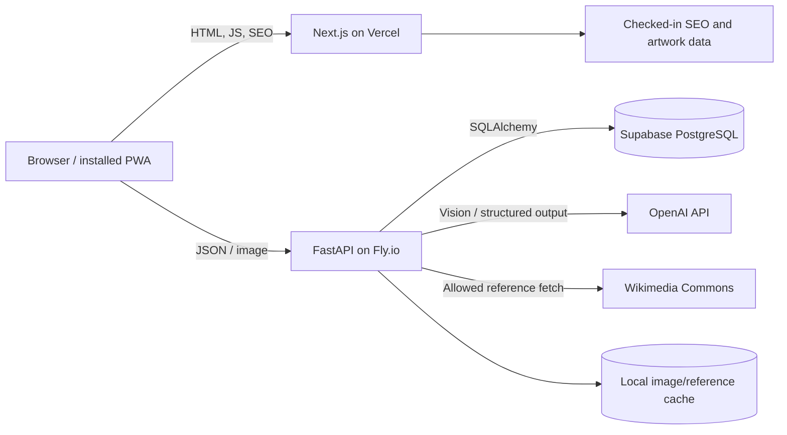
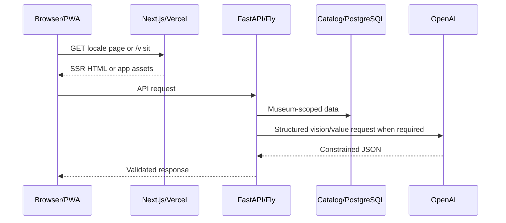
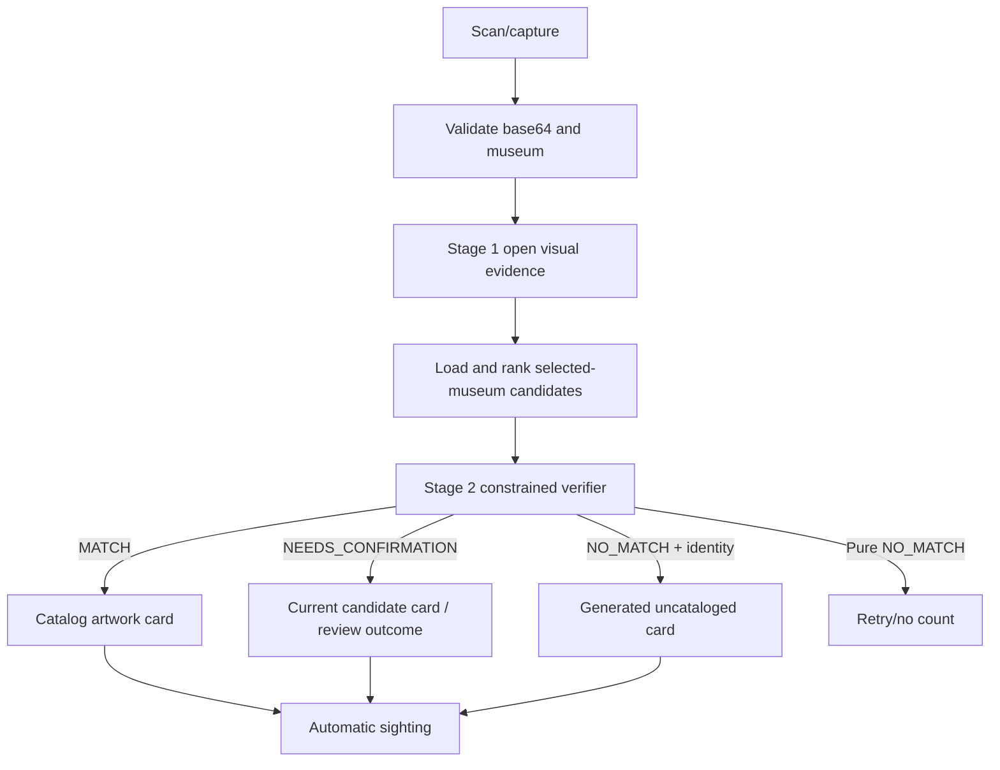
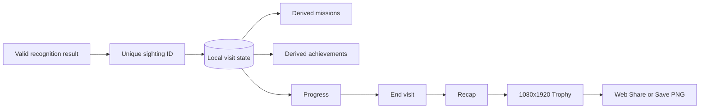
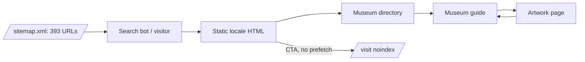

# ELYIO  Full System Audit & Operating Manual

Production snapshot  2026-08-16

> This is the canonical architectural and operating snapshot of ELYIO at the audited revision. It describes the service as observed, not an aspirational design. No credential values, user records, or private media are included.

## Table of Contents

1. [Audit methodology](#0-audit-methodology)
2. [Executive system summary](#1-executive-system-summary)
3. [Current production snapshot](#2-current-production-snapshot)
4. [Repository map](#3-repository-map)
5. [Frontend architecture](#4-frontend-architecture)
6. [Complete route inventory](#5-complete-route-inventory)
7. [PWA architecture](#6-pwa-architecture)
8. [Museum directory](#7-museum-directory)
9. [Artwork data model](#8-artwork-data-model)
10. [Recognition system](#9-recognition-system)
11. [Generated artwork experience](#10-generated-artwork-experience)
12. [Image provenance / hero system](#11-image-provenance--hero-system)
13. [Value Engine](#12-value-engine)
14. [Scale / WOW comparison engine](#13-scale--wow-comparison-engine)
15. [Normal / Simple / Kids modes](#14-normal--simple--kids-modes)
16. [Visit state / automatic sightings](#15-visit-state--automatic-sightings)
17. [Missions](#16-missions)
18. [Achievements](#17-achievements)
19. [Favorites](#18-favorites)
20. [Progress screen](#19-progress-screen)
21. [Recap](#20-recap)
22. [Social Trophy](#21-social-trophy)
23. [Share / export](#22-share--export)
24. [Audio / TTS](#23-audio--tts)
25. [Localization](#24-localization)
26. [Public SEO architecture](#25-public-seo-architecture)
27. [Sitemaps](#26-sitemaps)
28. [Google / Bing / IndexNow](#27-google--bing--indexnow)
29. [Structured data](#28-structured-data)
30. [Analytics](#29-analytics)
31. [Auth / user account state](#30-auth--user-account-state)
32. [Backend architecture](#31-backend-architecture)
33. [API reference](#32-api-reference)
34. [Data flow diagrams](#33-data-flow-diagrams)
35. [Image / media pipeline](#34-image--media-pipeline)
36. [Performance](#35-performance)
37. [Security / privacy surface](#36-security--privacy-surface)
38. [Environment variables](#37-environment-variables)
39. [Build / test / run commands](#38-build--test--run-commands)
40. [Deployment](#39-deployment)
41. [Deployment verification checklist](#40-deployment-verification-checklist)
42. [Rollback / recovery](#41-rollback--recovery)
43. [Test / regression inventory](#42-test--regression-inventory)
44. [Louvre research / Phase2D status](#43-louvre-research--phase2d-status)
45. [Git / branch state](#44-git--branch-state)
46. [Generated / local-only artifacts](#45-generated--local-only-artifacts)
47. [System invariants — Do Not Break](#46-system-invariants--do-not-break)
48. [Known limitations](#47-known-limitations)
49. [Technical debt / risks](#48-technical-debt--risks)
50. [What is not currently used](#49-what-is-not-currently-used)
51. [Current product status matrix](#50-current-product-status-matrix)
52. [Onboarding: understand ELYIO in 30 minutes](#51-onboarding-how-to-understand-elyio-in-30-minutes)
53. [Safe change matrix](#52-safe-change-matrix)
54. [Current user flows](#53-current-user-flows)
55. [File / component ownership map](#54-file--component-ownership-map)
56. [Final audit summary](#55-final-audit-summary)

## 0. Audit methodology

### Evidence vocabulary

Every production-sensitive statement should be read with one of these evidence levels:

| Mark | Meaning |
|---|---|
| **CONFIRMED FROM CODE** | Directly inspected at audited Git revision. |
| **CONFIRMED FROM LIVE PRODUCTION** | Observed through production HTTP, Vercel, or Fly on 2026-08-16. |
| **CONFIRMED FROM DATA** | Counted from a checked-in dataset or current public API response. |
| **INFERRED** | Strong conclusion from code/configuration, but not exercised end-to-end in this audit. |
| **HISTORICAL / NOT CURRENT** | Present in history, research, or dormant files; not active production architecture. |
| **NOT VERIFIED** | Access, credentials, provider console, destructive action, or paid request was intentionally unavailable/not exercised. |

### Audit procedure and immutable snapshot

- **CONFIRMED FROM CODE:** audit began from clean `main` at `3adf605aca3ae5afd6f6d879b717c4f69682ad0c`; `origin/main` was the same SHA. The documentation branch was created from that point. No product file was changed.
- **CONFIRMED FROM LIVE PRODUCTION:** canonical frontend was `https://www.elyio.co`; Vercel production deployment `dpl_8T8kxZ4wz2Hc1hLMTMuGeTNHrPo9` was Ready.
- **CONFIRMED FROM LIVE PRODUCTION:** Fly app `elyio-api`, release version 37, release ID `MZzaeRX0025zqIZ1VxZjYgw2J`, served a healthy `GET /health` response.
- **CONFIRMED FROM CODE/LIVE/DATA:** routes, headers, static catalog, sitemap, public museum API, OpenAPI, state transitions, tests, deployment configuration, and source ownership were inspected independently.
- **NOT VERIFIED:** no recognition request, user-media upload, provider-console mutation, production database mutation, Phase2D run, deployment, rollback, or search-console action was performed.

The repository has historical AURA-named material. In this document, “ELYIO” means the current service under `web/` plus `backend/`; an AURA label is called out only when it remains an internal source/runtime identifier or is historical.

## 1. Executive system summary

ELYIO is a mobile-first AI museum companion delivered as an installable web application. A visitor selects a museum, photographs an artwork, receives a recognition result and an interpretive card, and builds a visit record that drives missions, achievements, progress, recap, and a shareable Social Trophy. The primary problem is the gap between seeing an unfamiliar work and getting immediate, approachable context without requiring a tour, pre-planning, or an account.

**Current production scope.** **CONFIRMED FROM DATA:** the directory exposes 1,222 French museum records, of which 12 are marked `CURATED`; 1,210 are `AI_GUIDE`. Coverage is France-oriented through Muséofile, with 51 records whose current city field is exactly Paris and 134 whose region field is Île-de-France. Curated coverage is concentrated in Paris/Île-de-France plus Château de Versailles. Three visitor/SEO languages are active: English, French, and Simplified Chinese.

**Recognition strategy.** A two-stage backend pipeline first asks OpenAI Vision for image-grounded observations and a tentative identity, then constrains the decision to candidates from the selected museum. Candidate ranking is deterministic/database-backed; the final verification is visual and museum-scoped. Louvre and other versioned museums use a top-N constrained verifier; Orsay/Orangerie use candidate reference-image verification. DINOv2 and embedding retrieval are not the active production candidate-generation path.

**Curated versus AI guide.** Known catalog works can resolve to checked-in editorial content or backend catalog facts. Confidently understood uncataloged works receive deterministic generated enrichment based on the recognition observations. Human/static catalog content has priority. Generated enrichment remains private visitor-state content and is not an indexable SEO page.

**Core loop and implementation**

| Stage | Current behavior | Primary implementation |
|---|---|---|
| Arrival | Locale homepage or `/visit`; public pages remain lightweight and crawlable. | `web/app/[locale]/page.tsx`, `web/app/visit/page.tsx` |
| Museum selection | Geolocation suggests a nearby museum; manual search/list remains available. | `web/components/screens/HomeScreen.tsx`, `web/lib/api.ts` |
| Scan | Mobile camera/file capture is converted to a JPEG data URL. | `web/components/screens/CameraScreen.tsx`, `web/components/ElyioApp.tsx` |
| Recognition | `POST /v1/recognize`, museum-scoped Stage 1/Stage 2 pipeline. | Recognition section of `backend/app/main.py` |
| Result | Known catalog card, factual fallback, or generated enrichment. | `web/components/screens/CardScreen.tsx`, `web/components/screens/UncatalogedCardScreen.tsx`, `web/lib/generated-enrichment.ts` |
| Value/story/look closer | Mode- and locale-aware content; reviewed/indicative/context value semantics. | `web/lib/artworks.ts`, `web/lib/valueReveal.ts`, `web/lib/scaleComparison.ts` |
| Automatic sighting | A valid visible matched or recognized result is inserted once by artwork ID. | `web/components/ElyioApp.tsx`, `web/lib/app-state.ts` |
| Favorite/mission/achievement | Favorites are independent; game state derives from current visit facts. | `web/lib/visit-game.ts`, result/progress screens |
| Scan again/progress | Visitor returns to camera or opens derived progress. | `web/components/screens/ProgressScreen.tsx` |
| Recap | Same visit facts are summarized at visit end. | `web/components/screens/RecapScreen.tsx` |
| Social Trophy/share | A 1080×1920 PNG is rendered locally and shared/saved. | `web/lib/recap-image.ts`, `web/components/screens/RecapScreen.tsx` |

The visitor receives first value without mandatory authentication. The app is local-first: browser state keeps the visit usable even if authenticated visit persistence is unavailable.

## 2. Current production snapshot

| Item | Audited production state | Evidence |
|---|---|---|
| Production domain | `https://www.elyio.co` | LIVE |
| Frontend platform | Vercel, Next.js App Router | CODE + LIVE |
| Frontend deployment ID | `dpl_8T8kxZ4wz2Hc1hLMTMuGeTNHrPo9` | LIVE |
| Frontend Git SHA | `3adf605aca3ae5afd6f6d879b717c4f69682ad0c` | CODE; deployment timing/source alignment confirmed, provider Git metadata not independently exported |
| Backend platform | Fly.io app `elyio-api`, region `cdg` | LIVE |
| Backend image | `registry.fly.io/elyio-api:deployment-01M009HM9V1XE0R0J2DF4E40HB` | LIVE |
| Backend release/machines | release v37; machines `28600d2ad44e58`, `48e2d90b903478`; shared 1 CPU/512 MB | LIVE |
| Node | local audited toolchain `v22.21.0`; exact Vercel runtime NOT VERIFIED | CODE/LOCAL |
| Python | `3.11` container base; local audit interpreter `3.14.0` | CODE |
| Next.js / React | Next `16.2.12`; React/ReactDOM `19.2.4` | CODE (`web/package-lock.json`) |
| API base URL | `https://api.elyio.co` | CODE + LIVE |
| Health endpoint | `GET https://api.elyio.co/health` → `200 {"status":"ok"}` | LIVE |
| Primary storage | Supabase/PostgreSQL backend; browser `localStorage`/`sessionStorage`; backend image disk cache; Cache Storage service-worker cache | CODE |
| Analytics | PostHog, explicit events, autocapture/replay disabled | CODE |
| AI provider | OpenAI: vision/structured recognition, indicative band selection, offline audio-generation tooling | CODE |
| Image proxy | Backend Wikimedia-only fetch/resize/cache endpoint; frontend proxy client for safe canvas/SEO images | CODE |
| Production locales | `en`, `fr`, `zh-hans` URLs; internal content locale `zh-Hans` | CODE + LIVE |

The backend FastAPI metadata still says “AURA API” version `0.1.0`. This is a current internal label, not the public product name.

### Secret handling snapshot

Only names belong in documentation. Important secrets include `OPENAI_API_KEY`, `DATABASE_URL`, and `SUPABASE_SECRET_KEY`; values are intentionally omitted. Browser-prefixed identifiers are public configuration but their values are also omitted here. Search verification files are intentionally public proofs, not private credentials.

## 3. Repository map

The current production application is not the old root prototype. The production frontend is `web/`; the production API is `backend/`.

| Path | Purpose and connections | Runtime criticality / lifecycle |
|---|---|---|
| `web/app/` | Next.js App Router layouts, locale SEO routes, `/visit`, internal previews, robots and sitemap route handlers. | Frontend production-critical; source. |
| `web/components/` | Visitor app orchestrator plus shared controls. | Production-critical. |
| `web/components/screens/` | Home, camera, artwork result, progress, recap screen implementations. `ElyioApp` owns their state transitions. | Production-critical, client-side. |
| `web/components/ui/` | Mode selector, listen button, install UI, navigation and reusable visual primitives. | Production-critical. |
| `web/components/seo/` | Crawlable public header/footer/cards/links; keeps SEO navigation as real anchors. | Production-critical public shell. |
| `web/lib/` | API client, app persistence, artwork resolver, auth, analytics, image provenance/proxy, PWA install, value, scale, visit game, recap renderer/share. | Core production logic; regression-sensitive. |
| `web/lib/data/` | Checked-in museum/artwork/editorial datasets and mission-era fixtures. | Static source data; some files are active, some legacy and must be reference-traced before edits. |
| `web/public/` | Manifest, service-worker template inputs/assets, icons, public audio, search verification files. | Deployed static assets; `sw.js` itself is generated. |
| `web/scripts/` | Regression scripts, SW stamping, IndexNow submission. | Build/QA/operations. Some scripts write generated output or make external requests. |
| `web/next.config.ts` | Canonical redirects, security/robot headers, image formats/domains, production build controls. | Production-critical configuration. |
| `web/package.json` | Frontend commands and dependency contract. | Production-critical. |
| `backend/app/` | FastAPI entry point, schemas/models/config, DB/session/JWT, recognition and image services. | Backend production-critical. |
| `backend/app/main.py` | Service entry point and all current API route definitions. | Backend production-critical. |
| Recognition section of `backend/app/main.py` | OpenAI Stage 1, candidate ranking/verification orchestration and outcome mapping. | Recognition-critical. |
| Indicative-value section of `backend/app/main.py` | Value Engine V4 band selection, validation, caps and cache. | Value-critical. |
| `backend/scripts/` | Imports, migrations, validation, benchmarks, audio generation, Louvre research/controlled tooling. | Mixed: inspect each script before use; many can mutate a configured database. |
| `backend/data/` | Runtime/reference cache or data when present locally; ignored where reproducible. | Generated/local unless explicitly tracked fixture. |
| `scripts/` | Root operational helpers where present. | Mixed; not the principal frontend command surface. |
| `docs/` | Canonical documentation. This file is the sole documentation addition in this audit branch. | Source documentation. |
| `exports/` | Local research, candidate manifests, QA/export outputs. | Ignored/local-only; preserve selectively, do not bulk commit. |
| `backups/` | Local safety copies. | Ignored/local-only; not runtime input. |
| `venv/`, `.venv*` | Reconstructable Python environments. | Local/generated; safe to recreate from requirements. |
| `frontend/`, `aura-mvp/`, root AURA specs | Earlier prototypes/archive. | HISTORICAL / NOT CURRENT unless a future change explicitly reactivates them. |

Important cross-links: locale pages consume `web/lib/seo-content.ts`; the visitor shell consumes `web/lib/api.ts`, `app-state.ts`, `artworks.ts`, `generated-enrichment.ts`, `valueReveal.ts`, and `visit-game.ts`; the API client targets `backend/app/main.py`; the latter contains recognition/value/image endpoint logic and connects to PostgreSQL.

## 4. Frontend architecture

ELYIO uses the Next.js App Router. Public localized pages are server-rendered/static-generated and the visitor application is a client state machine mounted at `/visit`.

### Public shell versus visitor application

`/` permanently redirects to `/en`. `web/app/[locale]/...` generates lightweight, crawlable locale home, museum-directory, museum, and artwork pages. Public CTAs use `SeoLink` with `prefetch={false}`, so simply reading an SEO page does not prefetch the interactive visit bundle. `/visit` is explicitly noindex and mounts `ElyioApp` plus service-worker registration.

This boundary matters because a search visitor can receive headings, text, links, image metadata, JSON-LD, and a CTA without downloading the whole museum workflow before intent. Within `/visit`, the five screen modules are currently statically imported by `ElyioApp`; it is not correct to claim each screen is separately dynamically chunked. Analytics initialization is deferred until an event is emitted.

### Rendering and route boundaries

- Locale SEO pages: Server Components/static generation; content comes from checked-in SEO datasets.
- `/visit`: client application; no authentication gate; local-first state.
- `/design` and `/louvre-golden20-preview`: internal/noindex.
- Desktop `/visit` at roughly 1100 px and wider presents `DesktopShell` with a marketing/phone preview; the actual interactive flow is mobile-oriented.
- Unknown museum/artwork/locales resolve through real not-found handling rather than a canonicalized soft 404.

### State and visitor lifecycle

`web/lib/app-state.ts` defines `home → camera → card → progress → recap`. `ElyioApp` owns the current screen and visit actions. `elyio-current-visit-v2` stores a versioned JSON snapshot in `localStorage`; session organic attribution is held in `sessionStorage`. A new visit resets prior visit facts. Authentication, when already present, identifies analytics and enables best-effort backend visit storage; local progress does not depend on it.

### Initial load, fonts, images, analytics

- `next/font` self-hosts Cormorant Garamond Latin weights 300/400/500/600 with `display: swap`.
- Next image output supports AVIF/WebP, fixed dimensions/sizes, and a one-year minimum cache TTL for safe optimized assets.
- Real above-fold artwork images use priority only when they are actual first-view content; below-fold public cards use deferred loading.
- PostHog autocapture, automatic pageviews, heatmaps, dead clicks, performance capture, and replay are disabled. Explicit events initialize the SDK on demand.
- Museum/geolocation/state/API work does not gate the server-rendered public shell. `/visit` performs its own client lifecycle.

## 5. Complete route inventory

| Pattern | Purpose | Render | Index | Auth/state | Main source / data |
|---|---|---|---|---|---|
| `/` | Canonical locale entry | Redirect | NO (redirect) | None | `web/app/page.tsx` → `/en` |
| `/en`, `/fr`, `/zh-hans` | Public localized home | Static SSR HTML | YES | None | `web/app/[locale]/page.tsx`, SEO content |
| `/{locale}/museums` | Museum directory landing | Static SSR HTML | YES | None | locale museums route, curated SEO museums |
| `/{locale}/museums/{museum-slug}` | Curated museum guide | Static generated | YES when exported SEO-ready | None | SEO museum/artwork data |
| `/{locale}/artworks/{artwork-slug}` | Standalone curated artwork page | Static generated | YES when exported SEO-ready | None | `seo-content.ts`, artwork data |
| `/visit` | Interactive visitor PWA | Client app shell | NO | Anonymous allowed; local visit state | `web/app/visit/page.tsx`, `ElyioApp` |
| `/design` | Internal design surface | App route | NO | None | `web/app/design/` |
| `/louvre-golden20-preview` | Internal research preview | App route | NO | Local artifact-dependent | preview route |
| `/robots.txt` | Crawler policy | Dynamic/static metadata route | N/A | None | `web/app/robots.ts` |
| `/sitemap.xml` | Complete canonical URL set | XML route | N/A | None | `web/app/sitemap.xml/route.ts` |
| `/sitemap-urls.txt` | Same set, one URL per line | Text route | N/A | None | `web/app/sitemap-urls.txt/route.ts` |
| `/sitemaps/pages.xml` | Child public-page sitemap | XML route | N/A | None | child route |
| `/sitemaps/museums.xml` | Child museum sitemap | XML route | N/A | None | child route |
| `/sitemaps/artworks.xml` | Child artwork sitemap | XML route | N/A | None | child route |
| `/googlec7b9cb08d9dcb409.html` | Google verification proof | Static file | NO content page | None | `web/public/` |
| `/BingSiteAuth.xml` | Bing verification proof | Static file | NO content page | None | `web/public/` |
| `/0f44c665d01a4aa297623b805b457c14.txt` | IndexNow key proof | Static file | NO content page | None | `web/public/` |
| `/manifest.json`, `/sw.js`, icons/audio | PWA/media assets | Static | NO content page | None | `web/public/` |
| `https://api.elyio.co/v1/*` | Public/authenticated API | FastAPI JSON/binary | NO | Endpoint-specific | `backend/app/main.py` |

Canonical policy: `https`, lowercase locale/slugs, `www.elyio.co`, and no trailing slash in canonical content URLs. Apex requests redirect to `www`; `/` redirects to `/en`; query variants are not sitemap entries and page canonical metadata points to the clean same-language URL. Preview deployments receive `X-Robots-Tag: noindex, nofollow`; `/visit` and internal routes receive noindex headers/metadata.

## 6. PWA architecture

### Files and installation

- `web/public/manifest.json`: name `ELYIO`, start URL `/visit`, scope `/`, portrait, standalone display, ELYIO colors, 192/512 any-purpose and maskable icons.
- `web/sw-template.js`: hand-maintained service-worker source.
- `web/scripts/stamp-service-worker.mjs`: creates ignored/reproducible `web/public/sw.js` before dev/build and stamps a new cache version.
- `web/components/ServiceWorkerRegister.tsx`: registers the worker at scope `/`, detects a waiting update, and exposes an explicit refresh action.
- `web/lib/pwaInstall.ts` and install UI: Chromium `beforeinstallprompt`, iOS Safari Add to Home Screen guidance, dismissal state, and install analytics.

### Cache and update behavior

Install precaches `/` and `/manifest.json`. Hashed Next assets, icons, and audio are cache-first. API and cross-origin requests are network-first with cached fallback where a response already exists. Same-origin navigations/other GETs use stale-while-revalidate. Activation deletes obsolete ELYIO caches and claims clients. There is deliberately no unconditional `skipWaiting`; a waiting update becomes active after visitor confirmation and reload.

The worker is registered by the `/visit` application, not globally by every SEO landing page. Focus, visibility, and `pageshow` trigger update checks. A first-ever offline visit is not guaranteed: recognition requires the backend/OpenAI, and uncached content/media cannot be created offline. Previously cached shell/assets and local visit state can remain available.

Android/Chromium can present a native install prompt. iOS uses browser instructions and `navigator.standalone`/display-mode detection. Standalone mode removes ordinary browser chrome but remains a web app: it still inherits browser camera, storage, networking, Web Share, background-execution, and eviction constraints. It is not a native binary and has no native offline recognition model.

Known limitation: the current manifest description still refers narrowly to Musée d'Orsay and is stale relative to the multi-museum service.

## 7. Museum directory

The backend museum table is populated from France's Muséofile directory plus curated identifiers/content imports. `GET /v1/museums` supplies current records. Each record has a stable internal ID, display name, slug, city/region/coordinates, geofence radius, `experience_level` (`CURATED` or `AI_GUIDE`), and artwork count.

On Home mount, the client requests the museum directory and may request browser geolocation. It recommends a museum within its geofence; denial/failure leaves manual selection available. The list prioritizes curated museums and highlights Louvre, Orsay, and Orangerie. Geolocation is selection assistance, not a recognition input, and no IP-based bot redirect is used.

### Current curated museums

Counts below are **CONFIRMED FROM LIVE DATA** on 2026-08-16, not historic report counts.

| Internal ID | Public name | Slug | City | API artwork count | Tier | Recognition / SEO |
|---|---|---|---|---:|---|---|
| `louvre` | Musée du Louvre | `musee-du-louvre` | Paris | 500 | CURATED | Versioned top-N verifier; localized SEO page |
| `orsay` | Musée d'Orsay | `musee-d-orsay` | Paris | 101 | CURATED | Reference-image verifier; localized SEO page |
| `orangerie` | Musée de l'Orangerie | `musee-de-l-orangerie` | Paris | 15 | CURATED | Reference-image verifier; localized SEO page |
| `museofile_m1104` | Musée Carnavalet | `musee-carnavalet` | Paris | 30 | CURATED | Versioned top-N verifier; localized SEO page |
| `museofile_m5003` | Musée de Cluny | `musee-de-cluny` | Paris | 30 | CURATED | Versioned top-N verifier; localized SEO page |
| `museofile_m5025` | Musée de l'Armée | `musee-de-l-armee` | Paris | 30 | CURATED | Versioned top-N verifier; localized SEO page |
| `museofile_m5055` | Musée du quai Branly – Jacques Chirac | `musee-du-quai-branly-jacques-chirac` | Paris | 30 | CURATED | Versioned top-N verifier; localized SEO page |
| `museofile_m5005` | Musée Guimet | `musee-guimet` | Paris | 30 | CURATED | Versioned top-N verifier; localized SEO page |
| `museofile_m5043` | Musée Picasso Paris | `musee-picasso-paris` | Paris | 30 | CURATED | Versioned top-N verifier; localized SEO page |
| `museofile_m5044` | Musée Rodin | `musee-rodin` | Paris | 30 | CURATED | Versioned top-N verifier; localized SEO page |
| `museofile_m1111` | Petit Palais | `petit-palais` | Paris | 30 | CURATED | Versioned top-N verifier; localized SEO page |
| `versailles` | Château de Versailles | `chateau-de-versailles` | Versailles | 50 | CURATED | Versioned top-N verifier; localized SEO page |

The API's `artwork_count` is catalog inventory, not the number of fully editorial/indexable artwork pages. Current SEO artwork pages are intentionally a smaller quality-filtered set.

## 8. Artwork data model

The frontend `Artwork` contract and backend database together represent identity, presentation, editorial state, and recognition metadata. Important fields include:

- `id`, `museumId`, title/localized title, artist/raw artist, human year/raw date, hall/location, inventory number.
- `image`/`imageUrl`, image source class and source identity, accent/palette hints.
- priority (`top20`, `top100`, `featured`, `standard`), `needsEditorialReview`, `editorialStatus`, Kids eligibility.
- Normal/Simple/Kids copy for “Why it matters”, “Look closer”, position/rarity/context, and value reveal.
- audio URL/script where a static recording exists.
- reviewed estimate or AI indicative estimate, market context, version, confidence, source/provenance and aggregate eligibility.
- recognition/candidate membership, catalog version, SEO readiness and public slug in their respective data layers.

`web/lib/data/artworks.json` contains 116 frontend records; `web/lib/seo-content.ts` adds the Mona Lisa SEO entry, producing 117 current localized artwork SEO entities. All 116 JSON records currently carry `needsEditorialReview: true` and `editorialStatus: draft`; this flag is therefore not synonymous with absence from the visitor catalog. Of those records, 106 have estimate ranges and 101 have audio metadata. Backend catalog rows extend recognition coverage beyond this static editorial set.

### Content classes

| Class | Meaning | Source / precedence | Public SEO |
|---|---|---|---|
| FULL CURATED | Stable known work with authored/localized card fields and trusted identity/image. | Checked-in artwork/SEO data; wins over generated content. | Eligible when explicitly SEO-ready. |
| FACTUAL / FALLBACK | Backend catalog identity/details without a full authored frontend card. | `GET /v1/artworks/{id}` and recognition response. | Only if separately approved as useful factual SEO; not automatic. |
| GENERATED ENRICHMENT | Deterministic visitor-card expansion from recognition observations. | Browser cache, versioned generator. | No automatic index page. |
| AI-RECOGNIZED UNCATALOGED | Identity/evidence returned without selected catalog row. | Recognition response + generated enrichment; best-effort backend sighting aggregation. | Private/noindex. |

## 9. Recognition system

### Contract and request lifecycle

`POST /v1/recognize` accepts a non-empty base64-encoded image plus the selected `museum_id` and optional context. The API rejects oversized input (default maximum 8,000,000 base64 characters), invalid encoding, missing database dependencies, and invalid request shapes before recognition. The raw image is not written to an artwork table by this endpoint.

1. The API loads recognition candidates whose `museum_id` equals the selected museum and, for versioned catalogs, whose membership/version is currently active.
2. **Stage 1 — open visual interpretation.** OpenAI Vision (`OPENAI_RECOGNITION_MODEL`, default `gpt-4o`) receives the visitor image and museum context. It returns structured visual evidence, tentative artist/title/date/object type, confidence, and explanatory signals. Candidate IDs are intentionally not supplied at this stage.
3. Deterministic ranking scores museum candidates using normalized artist/title/date/hall/text evidence and selects a small top set (normally five).
4. **Stage 2 — constrained decision.** The model/verifier may choose only an allowed museum candidate or emit `NEEDS_CONFIRMATION`/`NO_MATCH`. Chosen IDs are checked against the candidate set and artist-consistency guards.
5. The API returns a catalog `match`, a `needs_confirmation` result, or `no_match`; an understood uncataloged identity may accompany `no_match`.

### Museum isolation and verifier variants

Louvre, Versailles, Rodin, Picasso, Quai Branly, Guimet, Cluny, Carnavalet, Petit Palais, and Musée de l'Armée use the versioned top-N verifier. Orsay and Orangerie use a candidate visual verifier against an allowed Wikimedia reference image, with a runner-up retry when the first candidate is rejected. All candidate lookup begins with the selected museum; a work from another museum cannot leak in as a candidate. If the visitor selected the wrong museum, the likely result is no match/uncataloged interpretation—not an automatic cross-museum correction.

`RecognitionAsset` rows can support eligible non-Louvre visual reference handling, but Louvre assets are explicitly quarantined from replacing authoritative images. Embeddings/DINOv2 do not generate the production top-N list.

### Confidence and outcomes

- `MATCH`: normalized confidence at/above the automatic threshold (default 0.92) and a valid selected candidate. Frontend loads static content first, backend detail second, renders the card, and records a sighting.
- `NEEDS_CONFIRMATION`: review confidence (default 0.82) with ambiguity. The current frontend renders the candidate card and records it immediately; there is no separate accept/reject confirmation control. This is a documented P1 semantic gap.
- `NO_MATCH` with a confident identity: frontend builds an uncataloged generated card and records that generated ID; backend may upsert anonymized artist/title aggregate data in `uncataloged_sightings`.
- Pure `NO_MATCH`: camera displays a retry/no-match state; no artwork is counted.
- Network/API failure: pending capture is kept for retry; no sighting is counted.
- Repeat known catalog scan: stable artwork ID is deduplicated. Repeat uncataloged scans currently use time-derived IDs and are not guaranteed to deduplicate.

OpenAI/verifier failure is mapped defensively to no-match confidence zero; missing `OPENAI_API_KEY` is a service configuration error unless explicit development mock mode is enabled. The recognizer can make outbound requests to OpenAI and, for reference verification/cache misses, approved Wikimedia hosts. It queries PostgreSQL/Supabase. Importing modules or running syntax tests does not itself mutate production; invoking the endpoint does consume external AI and may update uncataloged aggregate records.

### Explicit non-production recognition systems

- DINOv2 research/benchmarks: **HISTORICAL / NOT CURRENT**.
- Embedding nearest-neighbor candidate generation: **HISTORICAL / NOT CURRENT**.
- RecognitionAssets as a general Louvre retrieval architecture: **NOT CURRENT**; Louvre substitution is quarantined.
- Louvre Phase2D controlled scale-up tooling: **UNMERGED RESEARCH**, not invoked by the production request path.

## 10. Generated artwork experience

Universal Artwork Intelligence activates when a recognition result has usable identity/visual observations but no full static card. `web/lib/generated-enrichment.ts` produces locale-aware Normal/Simple/Kids sections, “Why it matters”, “Look closer”, rarity/context, and a value-context request. It is deterministic application code, not an extra live free-form editorial LLM call.

The cache namespace/version is `generated-artwork-enrichment-v2`. Its `localStorage` key includes the version plus normalized artist/title/date/object type. Cached content is schema/version validated; there is no time-based TTL, so a version bump is the invalidation mechanism.

Precedence is:

1. Human/static catalog card and reviewed value.
2. Backend factual catalog detail.
3. Versioned generated enrichment.

A trusted reference image is retained. Otherwise the current visitor capture becomes the hero. If neither is usable, a placeholder is allowed. Generated works enter the same sighting/favorite/progress pipeline but never acquire a public SEO URL merely because the browser generated a card.

## 11. Image provenance / hero system

`web/lib/types.ts` defines the classes and `web/lib/app-state.ts` classifies/applies them:

| Class | Meaning | Reuse |
|---|---|---|
| `REFERENCE_REAL` | Trusted catalog/public reference image. | Results, public SEO where rights-safe, recap/trophy. |
| `VISITOR_CAPTURE` | The user's local scan image. | Private current visit/results/recap/trophy only. |
| `PLACEHOLDER` | Decorative fallback, not evidence of the artwork. | Last resort only. |

Priority is trusted real reference, then visitor capture, then placeholder. The invariant implemented by `withCapturedScanFallbackImage` is: **a placeholder must not suppress a real visitor capture**. The visitor image can replace placeholder state but cannot overwrite a trusted reference.

Public artwork images can originate from Wikimedia Commons and pass through `https://api.elyio.co/v1/image-proxy` for safe resizing/canvas use. The proxy allowlists Wikimedia hosts, constrains widths (64–2048), converts/caches JPEG output, and sends long-lived immutable caching headers. Visitor captures are never used in SEO metadata/sitemaps and are not public routes. Trophy rendering chooses the favorite's trusted/captured hero where possible; unusable placeholders result in branded generated artwork rather than falsely presenting the placeholder as the work.

## 12. Value Engine

The active version is **Value Engine V4**, code identifier `ai-indicative-estimate-v4` in frontend and backend.

### Semantic tiers

| Product tier | Code representation | Meaning/source | Display | Totals / achievements |
|---|---|---|---|---|
| `REVIEWED_WORK_ESTIMATE` | `ESTIMATED_VALUE` with reviewed source | Human-reviewed work-specific low/high EUR range. | Work value range with reviewed provenance. | Eligible; contributes deterministically. |
| `AI_INDICATIVE_ESTIMATE` | `ESTIMATED_VALUE` with V4 version/confidence | Model selects a constrained valuation band from work identity/context; not an appraisal. | ELYIO indicative range and confidence. | MEDIUM/HIGH valid estimates eligible; LOW excluded. |
| `ARTIST_MARKET_CONTEXT` | `MARKET_CONTEXT` | Context about artist/category market, not the viewed object's value. | Clearly contextual. | Never summed as viewed-work value. It may inform the separate contextual “Market Giant” signal. |
| `BEYOND_MARKET` | `BEYOND_MARKET` | Canonical/cultural works for which market pricing would mislead. | Cultural/market-limit language, no numeric total. | Never summed. |
| `NO_CONTEXT` | No reveal | Insufficient or ineligible evidence. | No invented number. | None. |

### Calculation and safety

The backend model does not invent arbitrary euros. It selects one of fixed bands V01–V14, spanning €0.1–0.25 million through €600–1,000 million. Code maps the band to absolute EUR low/high values. It validates currency, band identity, finite positive ordered bounds, maximum 10× range ratio, version, and a catastrophic €1 billion ceiling.

Without a credible market anchor, confidence caps are HIGH €120m, MEDIUM €70m, LOW €10m. With an anchor, caps are approximately 3×/2.5×/1.25× the converted anchor for HIGH/MEDIUM/LOW, never above €1b; an over-cap selection is downgraded to the highest valid band. Ineligible categories include human remains/mummies, funerary fragments, coins, weapons/armor, ritual objects, sarcophagi, and architectural spaces.

The calculation is deterministic after band selection. The backend in-memory cache keys version plus normalized inputs and resets on process restart. The frontend validator rejects wrong versions as stale-schema values; **no independent calendar-age expiration was found**. Thus “stale rejection” currently means version/fingerprint incompatibility, not a date TTL.

Reviewed values and `BEYOND_MARKET` policy always win over generated AI context. Canonical works can intentionally be beyond-market. LOW-confidence AI estimates remain displayable as qualified context but `getIndicativeEligibleValue` excludes them from monetary totals and monetary achievements.

Visit totals maintain reviewed and eligible-indicative contributions, then expose a range. Current UI uses `TOTAL VALUE VIEWED` with the qualifier `ELYIO indicative estimate`. `ARTIST_MARKET_CONTEXT` is not added to that sum. “Billion Euro Visitor” checks the eligible visit low bound; “Market Giant” can also reflect a large contextual market signal and must not be interpreted as a total of owned/saleable works.

### Examples, not rules

- A reviewed €100m–€120m record contributes that exact reviewed range.
- A V4 MEDIUM estimate contributes only after band/version/range validation.
- A LOW €5m–€10m indicative display contributes zero to total and “Billion Euro Visitor”.
- An artist auction context of €100m may support “Market Giant” context, but adds zero to value viewed.

## 13. Scale / WOW comparison engine

`web/lib/scaleComparison.ts` makes a large range understandable using fixed reference costs. It uses the value midpoint for comparison count, explicit currency conversion constants, deterministic division and deterministic rounding. The language model never performs the comparison arithmetic.

References include aircraft, Ferrari-class supercars, central Paris apartments, yachts, football transfers, family holidays, bicycles, and Kids-mode ice creams. Normal returns up to three broader cultural/luxury comparisons; Simple returns up to two concise comparisons; Kids favors up to three familiar objects while retaining selected spectacular references.

Rounding becomes coarser as counts grow: small counts can retain useful precision, tens/hundreds use whole or stepped values, and very large counts use compact magnitude-aware formatting. The same inputs, mode, locale, and source table produce the same comparison. A market-context number may be compared only as context; comparison rendering does not convert it into a work valuation.

## 14. Normal / Simple / Kids modes

| Mode | Audience/content | Value and scale | UI/persistence |
|---|---|---|---|
| Normal | Default adult editorial density and vocabulary; full “Why/Look closer/context.” | Full qualified range/context and up to three comparisons; static audio available. | Mode selector in visit UI; stored with later persisted visit snapshots. |
| Simple | Visitors wanting shorter, plainer explanations. | Same underlying safe semantics, fewer concise comparisons. | Shared card structure, locale-aware copy. |
| Kids | Child-friendly vocabulary, observation prompts, familiar comparisons. | No relaxed safety; ice cream/bicycle-style scale language. | Some static works explicitly excluded and show a safe fallback. |

Static cards resolve the selected variant and fall back to Normal only when the variant is absent. Generated enrichment creates all three variants. Audio playback is currently Normal-mode only. Mode changes update React state immediately; the mode field exists in the persisted visit snapshot, but the setter itself does not write immediately—another subsequent state-persisting action makes it durable.

Localization and mode are orthogonal: each mode resolves in `en`, `fr`, or `zh-Hans`; missing localized fields follow explicit fallback helpers rather than mixing arbitrary fragments.

## 15. Visit state / automatic sightings

A visit begins when the user taps Begin Visit after museum selection. The frontend creates local state immediately: museum, start timestamp, empty seen/added/favorite sets and counters. It then attempts `POST /v1/visits` if an authenticated session exists; failure is swallowed so the local visit continues.

When a valid known match or understood uncataloged result becomes visible, `ElyioApp` records the artwork ID through an append-unique operation and marks it added. The backend artifact call is best-effort when a server visit ID exists. Favorite is a separate toggle; favoriting can backfill the sighting if necessary, but sighting does not require favorite.

| Outcome | Counts? | Persistence behavior |
|---|---|---|
| Stable catalog match | Once per stable ID | Local; backend best effort when authenticated visit exists |
| Current `needs_confirmation` candidate | Yes, immediately | Same as match; confirmation UI gap noted |
| Understood uncataloged result | Yes | Generated time-derived ID; repeat dedupe not guaranteed |
| Pure no-match | No | Camera status only |
| Network error | No | Pending capture retained for retry |
| Repeat stable catalog scan | No additional count | Existing ID remains unique |

Artwork count is unique seen IDs. Artist count is distinct normalized non-unknown artist names. Elapsed time is derived from `startedAt` to now/completion, with display minimum handling. Favorites are a set and ordered list, independent of sightings. State is stored under `elyio-current-visit-v2`; no server dependency is required to reopen local progress.

## 16. Missions

The active mission engine is derived in `web/lib/visit-game.ts` from current visit facts. It does not persist counters separately; it recomputes progress from seen artworks, artist/category/period tags, favorite count, and curated status, then persists the visit facts.

Current generated missions are:

| Mission ID | Goal / eligibility |
|---|---|
| `scan_3` | See 3 artworks. |
| `unique_artists_3` | See 3 distinct known artists. |
| `favorite_1` | Choose a favorite. |
| `scan_5` | See 5 artworks. |
| `unique_artists_5` | See 5 artists. |
| `curated_3` | See 3 records the game classifies as curated. |
| `scan_10` | See 10 artworks (“10 Masterpieces” presentation). |
| `renaissance_3` | Eligible when Renaissance-tagged works are present; see 3. |
| `impressionist_3` | Eligible when Impressionist-tagged works are present; see 3 (“Impressionist Trail”). |
| `explorer_3` | Discover 3 category groupings when category data supports it. |
| `new_artist` | Prompt for one more artist; target is current count + 1. |

Progress UI chooses a primary mission and shows current/target/completion. Completion feeds achievement/toast analytics. `new_artist` is intentionally/accidentally rolling and therefore is not a fixed completable target in the current derivation.

`web/lib/data/missions.json` and `web/lib/missions.ts` contain older Dots & Dabs / Self Portrait / highest-aggregate mission structures. Reference tracing did not show them as the active Progress mission source; treat them as dormant legacy data.

## 17. Achievements

Achievements are deterministically derived by `web/lib/visit-game.ts`; unlock timestamps are merged into persistent visit state and new unlocks can trigger toast/analytics.

| Achievement | Current trigger |
|---|---|
| First Discovery | At least 1 seen artwork. |
| Curious Eye | At least 5 seen artworks. |
| 10 Masterpieces | At least 10 seen artworks. |
| Artist Explorer | At least 5 distinct artists. |
| New Favorite | At least 1 favorite. |
| Renaissance Explorer | At least 5 Renaissance-tagged works. |
| Impressionist Trail | At least 5 Impressionist-tagged works. |
| Deep Dive | At least 30 elapsed minutes or at least 5 works. |
| Billion Euro Visitor | Eligible indicative visit low bound at least €1 billion. |
| Market Giant | Largest valid work/context high signal at least €100 million. |
| Museum Explorer | At least 3 category groupings. |

Monetary safety: LOW-confidence AI estimates are excluded from aggregate totals; `ARTIST_MARKET_CONTEXT` is never summed. Market Giant is a contextual signal and can use a large market-context observation, while Billion Euro Visitor relies on the aggregate-eligible visit range.

## 18. Favorites

Favorites are toggled from the artwork card. Multiple favorites are supported (`Set` plus `favoriteOrder`), although recap/trophy select the most recent favorite that is still present in the visit ordering. Favoriting and sighting are separate concepts; unfavoriting does not erase a sighting, and a sighting does not implicitly favorite.

The chosen favorite supplies title/artist and the preferred recap/trophy hero. Image resolution uses the provenance priority: trusted reference, visitor capture, then branded fallback. Favorites persist inside the same local visit snapshot; authenticated server persistence of the favorite flag is best effort through visit-artwork calls.

## 19. Progress screen

`web/components/screens/ProgressScreen.tsx` derives its entire display from `buildVisitGame` and current state:

- artworks: unique seen IDs;
- artists: distinct non-placeholder artist names;
- elapsed time: current time minus start/completion;
- mission: derived mission progress and selected primary mission;
- total indicative visit value: sum of reviewed plus valid MEDIUM/HIGH V4 estimates, never market context;
- favorite: most recent retained favorite;
- achievements: derived/unlocked list (the screen visually limits the displayed subset);
- discovery list: reverse chronological unique seen artworks and resolved images.

No duplicate analytics counter is the source of truth. “Finish visit” transitions to recap after final state persistence/backend completion attempt.

## 20. Recap

Recap is generated when the visitor ends the visit. `web/components/screens/RecapScreen.tsx` calls the same visit-game/value functions as Progress, preserving parity for artwork count, artist count, elapsed time, favorites, achievements, and aggregate-safe value. It selects a highlight achievement by deterministic priority and a hero from the preferred favorite, then other usable visit art.

Invariants: Progress and Recap must not calculate counts/value independently; favorite must be drawn from current favorites; market context and LOW confidence do not enter the total; placeholder must not outrank a visitor capture. Recap is local UI, not a public/user-specific indexable URL.

## 21. Social Trophy

The Social Trophy is a share artifact representing a completed visit, not an SEO preview card. `web/lib/recap-image.ts` renders a portrait canvas at **1080×1920 px (9:16)** and exports PNG.

Pipeline:

1. Build the same visit summary used by Recap.
2. Select most recent usable favorite hero; otherwise select the best visit image; otherwise paint a branded fallback.
3. Proxy cross-origin reference art through the ELYIO image proxy at an appropriate width; visitor data URLs remain local.
4. Draw cover crop, overlays/palette, ELYIO/museum identity, visit headline, artwork/artist/time stats, value moment, favorite title/artist, and selected achievement.
5. Encode PNG and pass it to the share/save layer.

The trophy uses a single rounded midpoint for legibility; the in-app card retains the low–high range. Current rounding uses compact magnitude behavior: billions to a useful decimal/integer, hundreds of millions to roughly €10m steps, tens of millions to €1m steps, and smaller millions to one decimal. The share label remains **“ELYIO indicative estimate”**. This number is not an appraisal and is not the sum of artist market contexts.

The UI offers Share and Save image. Social Trophy hero art should be the real favorite artwork where possible, including a private visitor capture when no reusable reference exists; it never publishes that image as an SEO asset.

## 22. Share / export

`web/components/screens/RecapScreen.tsx` converts the rendered canvas/blob to `elyio-visit-trophy.png`. On supporting mobile browsers it uses Web Share Level 2 with a file after checking `navigator.canShare`. If file sharing is unsupported, it attempts text sharing; if sharing is unavailable/fails without a user cancellation, it falls back to a browser download. Save image directly downloads the PNG.

Share text includes ELYIO visit context without representing the image as an appraisal. Cross-origin canvas taint is avoided by routing supported public images through the backend proxy; image load has a finite timeout. Browser limitations include iOS/Android differences in file-share support, download destinations, permission/user-gesture requirements, and memory pressure for a 1080×1920 canvas.

## 23. Audio / TTS

Audio exists as static, pre-generated MP3—not live production TTS. **CONFIRMED FROM DATA:** `web/public/audio/` contains 303 files, corresponding to 101 artwork scripts in three locales. Artwork records point to locale-specific URLs. `ListenButton` is available in Normal mode and emits playback start/completion analytics.

`backend/scripts/generate_audio_cache.py` is an offline authoring tool using OpenAI TTS and writes public audio plus catalog URL metadata. Running it requires network/API cost and changes tracked media/data; the production app does not call it during a visit. Works without an audio URL, including generated uncataloged cards, have no live synthesized narration.

## 24. Localization

| Concern | Current behavior |
|---|---|
| Locales | `en`, `fr`, `zh-hans` in URLs; `zh-Hans` internally/metadata. |
| Public URLs | Every indexable entity has a distinct locale URL. |
| HTML language | Locale layout sets `lang`; a small script synchronizes `document.documentElement.lang`. |
| Visitor UI | Locale dictionary/helpers; query from SEO CTA can initialize `/visit`. |
| Artwork copy | Localized titles/editorial variants when present; explicit fallback helpers. |
| Generated copy | Generator emits per-locale Normal/Simple/Kids content. |
| Audio | Separate static locale files where available. |
| SEO | Same-language canonical; reciprocal `en`, `fr`, `zh-Hans`; `x-default` points to English. |

Bots are not redirected by IP, cookie, or `Accept-Language`. French and Chinese remain crawlable stable URLs. Source metadata can remain untranslated when it is a proper name/inventory fact; helpers avoid mechanically concatenating mismatched language prose. Missing localized content falls back in a controlled order, so data incompleteness can still surface an English proper/factual field and should be reviewed editorially.

## 25. Public SEO architecture

The SEO surface is static/server-rendered HTML, separate from visitor state. Locale homepages link with real anchors to museum directories, museum guides, and artwork pages. Museum pages link highlights; artwork pages link their museum and related works. Each indexable page has a unique title/description, one visible H1, self-referencing same-locale canonical, reciprocal hreflang/x-default, Open Graph/Twitter metadata, breadcrumbs, visible surrounding image text, and truthful JSON-LD.

### Readiness policy

| Class | Policy |
|---|---|
| `SEO_READY_CURATED` | Indexable and included in sitemap. Current exported museums/artworks use this explicit set. |
| `SEO_READY_FACTUAL` | Indexable only when unique factual content is useful enough. Not automatically emitted from every DB row. |
| `GENERATED_ENRICHED` | Visitor utility only; no automatic indexing. |
| `THIN_INSUFFICIENT` | `noindex, follow`; omitted from sitemap. |
| `PRIVATE_USER_STATE` | Noindex/private; never sitemap/image SEO. |

**CONFIRMED FROM LIVE PRODUCTION:** current complete sitemap contains **393** canonical URLs: 3 locale homes, 3 directories, 36 museum pages, and 351 artwork pages. This equals 131 per locale. Internal/visit/query/redirect/error/generated URLs are excluded.

Artwork images use descriptive alt and `ImageObject`/sitemap image markup where safe. Private captures never enter public pages. `max-image-preview: large` is allowed globally for indexable content. No Product/Offer valuation markup exists.

## 26. Sitemaps

| Route | Current format / contents |
|---|---|
| `/sitemap.xml` | Complete XML `<urlset>` containing all 393 canonical URLs directly. |
| `/sitemap-urls.txt` | Exactly the same 393 URLs, one per line. |
| `/sitemaps/pages.xml` | 6 home/directory URLs. |
| `/sitemaps/museums.xml` | 36 localized museum URLs. |
| `/sitemaps/artworks.xml` | 351 localized artwork URLs. |

Breakdown: homes 3, directories 3, museums 36, artworks 351, other public content 0; English 131, French 131, Simplified Chinese 131. The XML includes reciprocal `xhtml:link` alternates (`en`, `fr`, `zh-Hans`, `x-default`) and safe artwork image entries. It omits `lastmod` because no trustworthy per-entity modification date is available; it does not fabricate today's date.

Excluded: `/`, redirects, `/visit`, session/scan/private state, `/design`, `/louvre-golden20-preview`, API routes, PWA/search verification assets, preview domains, query variants, 404s, generated/thin content, and noncanonical host/locale variants.

## 27. Google / Bing / IndexNow

- Google verification mechanism: public `web/public/googlec7b9cb08d9dcb409.html`, live HTTP 200. Search Console ownership state, sitemap submission state, and indexing reports are **NOT VERIFIED** because no console credentials were used.
- Bing verification mechanism: public `web/public/BingSiteAuth.xml`, live HTTP 200. Webmaster Tools ownership/submission is **NOT VERIFIED**.
- IndexNow: public key proof `web/public/0f44c665d01a4aa297623b805b457c14.txt`, live HTTP 200. The proof string is intentionally not reproduced. `web/scripts/submit-indexnow.mjs` can submit explicit changed URLs or sitemap-derived batches (up to 10,000) to the IndexNow endpoint. It is an operator action, never a pageview side effect.
- All engines can consume `https://www.elyio.co/sitemap.xml`; child sitemaps remain compatible organizational endpoints.

## 28. Structured data

| Schema type | Pages | Important visible/source-backed fields |
|---|---|---|
| `Organization` | Locale homes | ELYIO identity, canonical URL/logo. |
| `WebApplication` | Locale homes | Museum-guide application identity, web application/category/operating context. |
| `Museum` | Museum pages; nested artwork relationship | Name, URL, location/description/image when available. |
| `VisualArtwork` | Artwork pages | Title, creator, date, image, museum relationship, description. |
| `ImageObject` | Artwork pages | Rights-safe image URL/caption/representative metadata. |
| `BreadcrumbList` | Museum and artwork pages | Visible locale navigation hierarchy and canonical item URLs. |

JSON-LD is emitted from the same checked-in data as visible content. It does not invent reviews, ratings, prices, offers, authors, or provenance. ELYIO indicative values are deliberately absent from `Product`/`Offer`: the museum artwork is not being sold.

## 29. Analytics

`web/lib/analytics.ts` wraps PostHog. The SDK is initialized on first explicit event, not before public first paint. Automatic pageviews/autocapture/session replay/heatmaps are off. Identified profiles are used only after a real auth identity exists.

### Current event families

| Event name(s) | Trigger / important properties | Main caller |
|---|---|---|
| `visit_started`, `seo_begin_visit` | Begin Visit; museum, locale/mode; organic route/landing when present | `HomeScreen`, `ElyioApp` |
| `museum_selected`, geolocation events | Selection/suggestion action; museum/source | `HomeScreen` |
| `scan_attempt`, camera events | Capture/retry; museum, prior seen count | `CameraScreen`, `ElyioApp` |
| recognition success/no-match/error/candidate events | Outcome, confidence, candidate/museum, latency/error class | `ElyioApp` |
| artwork result/view/mode/audio events | Result kind, artwork/museum, mode/locale, audio start/complete | result screen/listen control |
| favorite events | Toggle and artwork identity | artwork card |
| mission/achievement events | Progress/completion/unlock IDs and counts | visit game/progress orchestration |
| `progress_viewed`, visit-complete/recap events | Current counts/duration/value eligibility | progress/recap |
| trophy/share/save events | Render/share method/success/failure | recap/share layer |
| PWA prompt/install/update events | Prompt availability/action/outcome, standalone/update | PWA install/SW components |

The type inventory also contains reserved events such as `seo_landing`, `mission_shown`, `paywall_viewed`, and `purchase_completed`; reference tracing did not confirm all are currently emitted. ELYIO has no active purchase flow in the audited primary funnel.

### Organic funnel

SEO CTAs link to `/visit?from=organic&locale=…&landing=…`. `ElyioApp` stores normalized attribution in `sessionStorage` (`elyio-organic-landing`), emits `seo_begin_visit`, and attaches the landing/locale/source context to later events. Begin Visit is directly measurable. The first scan is observable through the first `scan_attempt` and recognition outcome with the visit's zero/initial seen count, but there is no separately named `first_scan_conversion` event. A standalone `seo_landing` call was not confirmed; page-entry attribution begins when the visitor enters `/visit`.

## 30. Auth / user account state

Supabase client/auth code exists in `web/lib/supabase.ts`, `web/lib/useAuth.ts`, and auth UI components. It can restore a session, request magic-link sign-in, and initiate Google OAuth; Apple is marked/deferred. Auth callbacks remove token-bearing URL fragments before analytics/navigation handling.

Authentication is **not required for first scan**. The current Home flow does not mount the available Auth modal as a gate. The app is anonymous/local-first. If a Supabase session already exists, `ElyioApp` identifies analytics and can create/update backend visits. Backend visit endpoints validate Supabase JWT/JWKS and associate Visit/VisitArtwork rows with the user. Recognition, museum directory, artwork detail, indicative value, image proxy, and health endpoints are public.

Thus an anonymous visitor's durable state is browser-local; clearing site data or changing devices loses it. Auth UI/code exists but account persistence is not a mandatory or fully surfaced primary-flow promise.

## 31. Backend architecture

The backend is FastAPI served by Uvicorn from `backend/app/main.py`, built on `python:3.11-slim`, deployed to Fly, and connected through SQLAlchemy to Supabase/PostgreSQL. Pydantic validates request/response contracts. Major services cover recognition, candidate ranking/reference assets, indicative value, image proxy/cache, and Supabase JWT verification.



Logging records operational recognition events/errors and candidate metadata, not the raw base64 image. Errors are converted to HTTP validation/configuration errors or safe recognition outcomes. CORS is restricted to ELYIO production/Vercel/local development origins. No explicit application rate limiter was found; provider/platform controls are **NOT VERIFIED**.

## 32. API reference

Current production-relevant paths are **CONFIRMED FROM LIVE OpenAPI** and code.

| Method/path | Purpose | Request → response | Auth | Side effects / caller / failure |
|---|---|---|---|---|
| `GET /health` | Liveness | none → `{status:"ok"}` | No | No mutation; deployment checks. |
| `GET /v1/museums` | Directory/search/pagination | query filters/limit → museum list/count | No | Read-only DB; Home. DB errors HTTP 5xx. |
| `GET /v1/artworks/{artwork_id}` | Catalog detail fallback | path ID → artwork detail | No | Read-only DB; `api.ts`/result resolver; 404 unknown. |
| `POST /v1/recognize` | Two-stage museum-scoped recognition | base64 image + museum/context → match/confirm/no-match | No | OpenAI/network/DB; may upsert uncataloged aggregate; Camera flow. Validation/config errors or safe no-match. |
| `POST /v1/indicative-value` | V4 band estimate | artwork/context/anchors → qualified value reveal or none | No | OpenAI plus in-memory cache, no catalog write; result enrichment. |
| `GET /v1/image-proxy` | Safe Wikimedia resize/cache | URL + width → JPEG bytes | No | Network and local cache write; UI/canvas/SEO. Rejects hosts/widths/fetch errors. |
| `POST /v1/visits` | Create authenticated visit | museum/start context → visit ID/state | Supabase JWT | Inserts Visit; `api.ts` after Begin Visit; frontend remains local on failure. |
| `POST /v1/visits/{visit_id}/artworks` | Record sighting/favorite metadata | artwork facts → visit-artwork row | Supabase JWT | Insert/upsert/dedupe; `ElyioApp`; local state remains source on failure. |
| `GET /v1/visits/{visit_id}/progress` | Server visit progress | visit ID → aggregate progress | Supabase JWT | Read-only; optional account flow. |
| `POST /v1/visits/{visit_id}/complete` | Complete server visit | completion timestamp/context → completed visit | Supabase JWT | Updates Visit; end-visit flow. |

No explicit per-endpoint rate limits are declared in application code. OpenAPI does not prove platform/provider quotas.

## 33. Data flow diagrams

### A. System architecture



### B. Recognition flow



### C. Visit game flow



### D. SEO architecture



## 34. Image / media pipeline

Public catalog references live in checked-in metadata and commonly point to Wikimedia/Commons assets. Browser display can use approved external images under CSP; canvas/SEO-safe processing uses helpers in `web/lib/api.ts` and `web/lib/visitPalette.ts` plus backend `/v1/image-proxy`. The proxy validates the host, downloads on cache miss, uses Pillow for constrained JPEG output, hashes cache keys, and returns immutable cache headers.

Visitor captures are base64 data URLs in the local visit snapshot and are sent to the recognition API/OpenAI. They are not public files, sitemap images, or SEO pages. Backend code does not persist the raw recognition body in the catalog, and application logs do not intentionally include it. Provider retention and infrastructure request-body logging are **NOT VERIFIED**.

Social Trophy loads an allowed reference through the proxy or uses the local visitor data URL. Static audio is served from `web/public/audio`. Next supports AVIF/WebP for its image pipeline; backend proxy output is JPEG. External image hosts are constrained by Next configuration and CSP.

## 35. Performance

Current architecture optimizes the largest structural cost: public SSR/static pages and `/visit` are separate route boundaries, and SEO CTA links disable prefetch of the visitor app. Meaningful public HTML, headings, links, and copy do not wait for geolocation, museum API, auth restoration, PostHog, service-worker checks, or recognition. Next fonts are self-hosted; images have known sizing; analytics is explicit/deferred.

What loads immediately on a public page: locale layout/CSS/font requirements, public page component/data, first-view image, metadata/JSON-LD. What loads after visitor intent: `/visit` client application, camera flow, museum API/geolocation, local visit restoration, auth restoration, recognition/value calls, game/recap/trophy execution, and service-worker registration.

No current Lighthouse report files were found in the audited clean source/local artifact inventory, and this documentation audit did not run a synthetic benchmark. Therefore mobile Lighthouse, desktop Lighthouse, LCP, CLS, TBT, and JS-transfer numbers are **NOT VERIFIED for this snapshot**. Earlier user-reported high-70/low-80 mobile screenshots are historical context, not a reproducible current measurement. Field Core Web Vitals maturity is likewise not verified.

## 36. Security / privacy surface

- Secrets are server environment variables; no values are documented. Only `NEXT_PUBLIC_*` variables enter the browser.
- CSP restricts default source to self; explicit PostHog, API, Supabase and Wikimedia connections/images are allowed; `frame-ancestors 'none'`, HSTS, no-sniff, strict referrer, X-Frame-Options and upgrade-insecure-requests are configured.
- Non-production Vercel environments receive `X-Robots-Tag: noindex, nofollow`. Private app/internal routes are noindex.
- Recognition validates size/base64 and museum scope. Image proxy host/width validation limits SSRF/oversized transformation exposure.
- CORS is an explicit production/Vercel/local allowlist. No code-level rate limiter was found.
- Visitor captures live in browser storage and transit to ELYIO backend/OpenAI for recognition. They are not SEO indexed or intentionally logged as raw payloads. Provider retention, proxy-level logging and formal deletion SLA are NOT VERIFIED.
- Auth visit mutations require Supabase JWT verified with provider keys/JWKS; public content/recognition remains anonymous.
- `localStorage` is origin-readable by frontend JavaScript; CSP/XSS controls are therefore important. Large base64 captures can hit browser quota.

## 37. Environment variables

Values are intentionally omitted.

| Name | Side | Req. | Purpose / use | Prod? | Safe default | Secret? |
|---|---|---|---|---|---|---|
| `NEXT_PUBLIC_BACKEND_URL` | Frontend | Required | API base in `web/lib/api.ts`/image proxy | Yes | localhost only for dev | No |
| `NEXT_PUBLIC_SUPABASE_URL` | Frontend | Required for auth | Supabase client endpoint | Yes for account features | Placeholder disables useful auth | No |
| `NEXT_PUBLIC_SUPABASE_ANON_KEY` | Frontend | Required for auth | Browser Supabase public anon credential | Yes for account features | None | Public credential |
| `NEXT_PUBLIC_POSTHOG_KEY` | Frontend | Optional | Enables explicit analytics | Yes for measurement | Missing disables analytics | Public project key |
| `NEXT_PUBLIC_POSTHOG_HOST` | Frontend | Optional | PostHog ingestion/assets host | Yes | Code default US host | No |
| `VERCEL_ENV` | Frontend/platform | Platform | Production vs preview robot headers | Yes | Nonproduction treated noindex | No |
| `PWA_CHECK_URL` | QA script | Optional | Target for PWA runtime check | No | Production/default script URL | No |
| `CHROME_PATH` | QA script | Optional | Headless Chrome executable | No | Auto-discovery | No |
| `OPENAI_API_KEY` | Backend/scripts | Required for AI | Recognition, value selection, audio authoring | Yes | None | **Yes** |
| `OPENAI_RECOGNITION_MODEL` | Backend | Optional | Vision/decision model | Yes | `gpt-4o` | No |
| `OPENAI_INDICATIVE_VALUE_MODEL` | Backend | Optional | V4 band-selection model | Yes | Recognition model | No |
| `OPENAI_RECOGNITION_RETRIES` | Backend | Optional | AI retry count | Yes | `2` | No |
| `OPENAI_RECOGNITION_TIMEOUT_SECONDS` | Backend | Optional | AI request timeout | Yes | `35` | No |
| `ALLOW_RECOGNITION_MOCK` | Backend | Optional/dev | Explicit mock fallback | Must be false | false | No |
| `MAX_RECOGNITION_IMAGE_BASE64_CHARS` | Backend | Optional | Request-size guard | Yes | `8000000` | No |
| `DATABASE_URL` | Backend/scripts | Required | SQLAlchemy PostgreSQL connection | Yes | None | **Yes** |
| `SUPABASE_URL` | Backend | Required for auth | JWT issuer/JWKS context | Yes | None | No |
| `SUPABASE_SECRET_KEY` | Backend/ops | Optional to app; script-dependent | Privileged Supabase operations where invoked | Operational | None | **Yes** |
| `LOUVRE_CATALOG_VERSION` | Backend | Optional | Active Louvre membership/version | Yes | Code default | No |
| `VERSAILLES_CATALOG_VERSION` | Backend | Optional | Active Versailles version | Yes | Code default | No |
| `RODIN_CATALOG_VERSION` | Backend | Optional | Active Rodin version | Yes | Code default | No |
| `PICASSO_CATALOG_VERSION` | Backend | Optional | Active Picasso version | Yes | Code default | No |
| `QUAI_BRANLY_CATALOG_VERSION` | Backend | Optional | Active Quai Branly version | Yes | Code default | No |
| `GUIMET_CATALOG_VERSION` | Backend | Optional | Active Guimet version | Yes | Code default | No |
| `CLUNY_CATALOG_VERSION` | Backend | Optional | Active Cluny version | Yes | Code default | No |
| `CARNAVALET_CATALOG_VERSION` | Backend | Optional | Active Carnavalet version | Yes | Code default | No |
| `PETIT_PALAIS_CATALOG_VERSION` | Backend | Optional | Active Petit Palais version | Yes | Code default | No |
| `ARMEE_CATALOG_VERSION` | Backend | Optional | Active Musée de l'Armée version | Yes | Code default | No |

## 38. Build / test / run commands

Run from PowerShell unless noted. These commands are verified from repository scripts/configuration.

```powershell
cd D:\AURA\web
npm ci
npm run dev
npm run build
npm run lint
npm run test:result
npm run test:value
npm run test:scale
npm run test:visit
npm run test:pwa
```

Backend local environment/run:

```powershell
cd D:\AURA
python -m venv .venv
.\.venv\Scripts\python.exe -m pip install -r backend\requirements.txt
.\.venv\Scripts\python.exe -m uvicorn backend.app.main:app --reload --port 8090
.\.venv\Scripts\python.exe backend\scripts\catalog_regression_check.py
```

Generated-enrichment is `npm run test:result`; value is `test:value`; deterministic scale is `test:scale`; visit-game source/regression is `test:visit`; PWA live/runtime is `test:pwa`. Build automatically stamps `public/sw.js` through the package prebuild hook.

IndexNow is externally mutating search-engine state and should be run only for materially changed public URLs:

```powershell
cd D:\AURA\web
npm run indexnow -- https://www.elyio.co/en/example-changed-url
```

Do not run import/migration/Phase2D scripts merely as “tests”; inspect their CLI and target database first.

## 39. Deployment

### Frontend

Vercel builds `web/` as a Next.js application. Production source branch is `main`; canonical domain is `www.elyio.co`, with apex redirected. Build is `npm run build` (including SW stamp), and `next.config.ts`, Vercel project settings, `.vercelignore`, environment variables, headers, redirects, and remote image configuration are operationally important.

### Backend

Fly.io builds `backend/Dockerfile`, installs `backend/requirements.txt`, and starts Uvicorn `backend.app.main:app` on port 8080. `backend/fly.toml` configures app/region/HTTP service, health behavior, auto-start/auto-stop, and minimum machines. Production health is `https://api.elyio.co/health`.

| Change | Deploy needed |
|---|---|
| `web/app`, components, frontend lib/data/public/config | Frontend |
| `backend/app`, requirements, Docker/Fly config | Backend |
| Shared contract changed on both sides | Both, compatibility-sequenced |
| Docs/research/local exports only | Neither |
| Database import/migration | Operational DB action; backend deploy only if runtime code also changes |

This audit created no deployment.

## 40. Deployment verification checklist

### Frontend

- [ ] `https://www.elyio.co/en`, `/fr`, `/zh-hans` return 200 and meaningful HTML.
- [ ] `/visit` opens without auth, camera entry works, and console has no hydration error.
- [ ] Representative museum/artwork pages have title, H1, canonical, hreflang, JSON-LD and real links.
- [ ] `/sitemap.xml`, `/sitemap-urls.txt`, `/robots.txt`, verification files return 200.
- [ ] `/visit`, `/design`, internal previews and preview deployments are noindex.
- [ ] Manifest/icons/SW installability and update prompt pass `npm run test:pwa`.

### Backend

- [ ] `/health` returns 200.
- [ ] `/v1/museums` returns expected totals and 12 curated museums.
- [ ] A consented safe test image exercises match, no-match, and wrong-museum isolation.
- [ ] No cross-museum candidate ID appears; API errors contain no secrets/raw image.

### Visitor/game

- [ ] Begin Visit → first scan → result works anonymous.
- [ ] Valid result auto-counts once; repeat stable scan does not inflate.
- [ ] No-match/network failure does not count.
- [ ] Favorite remains separate; missions/achievements update once.
- [ ] Progress equals Recap; Trophy uses the expected hero/value/achievement.
- [ ] Web Share and Save image produce a 1080×1920 PNG.

### SEO

- [ ] Exactly 393 sitemap URLs (or an intentionally reviewed new count), no duplicates/redirects/404/noindex.
- [ ] Canonical host/locale policy and internal link graph remain reciprocal.
- [ ] Indicative values never enter Product/Offer schema.

## 41. Rollback / recovery

- **Vercel:** promote/redeploy the previous known-good production deployment in the Vercel project, then verify aliases, headers, sitemap and `/visit`. Exact organization permissions/runbook are NOT VERIFIED. A rollback across a service-worker change requires observing the waiting-worker lifecycle; clients may retain old caches until activation/reload.
- **Fly:** redeploy the prior immutable Fly image/release or use the provider's release rollback mechanism, then verify both machines and `/health`. Exact operator command/permission was not exercised. Database mutations are not reverted by an image rollback.
- **Database imports/migrations:** require an operation-specific backup and reverse/reconciliation script. Never assume Git rollback reverses catalog rows.
- **Generated enrichment:** bumping generator/cache version invalidates browser-generated cards; old localStorage remains until overwritten/cleared. There is no remote cache purge for browser entries.
- **Visitor local state:** versioned localStorage may survive deploy/rollback. Schema changes need migration or safe reset; clearing state loses anonymous visits.
- **Image/SW caches:** immutable URLs/versioned cache names should change when bytes/behavior change; proxy disk cache can outlive a backend code release.

## 42. Test / regression inventory

| Script | Purpose | Scope / destructive? | Network / typical runtime |
|---|---|---|---|
| `web/scripts/generated-enrichment-regression.mjs` | Generated card precedence/schema/content guards | Local read/test; non-destructive | No; seconds |
| `web/scripts/value-reveal-regression.mjs` | V4 tiers/eligibility/aggregation guards | Local; non-destructive | No; seconds |
| `web/scripts/scale-comparison-regression.mjs` | Deterministic comparison and rounding | Local transpile/run; non-destructive | No; seconds |
| `web/scripts/visit-game-regression.mjs` | Sightings/game/achievement source guards | Local; non-destructive | No; seconds |
| `web/scripts/pwa-runtime-check.mjs` | Manifest/SW/install/offline/source checks | Temporary Chrome profile; no production mutation | Browser/network; seconds–minutes |
| `web/scripts/stamp-service-worker.mjs` | Generate versioned `public/sw.js` | Writes reproducible generated file | No; seconds |
| `web/scripts/submit-indexnow.mjs` | Notify IndexNow of changed public URLs | External submission side effect | Yes; seconds/minutes |
| `backend/scripts/catalog_regression_check.py` | Catalog fixtures/schema/count invariants | Local, read-only | No; seconds |
| `backend/scripts/catalog_parity_check.py` | Compare expected/current DB catalog | DB read-only when used correctly | Yes/DB; seconds–minutes |
| `backend/scripts/latency_test.py` | Recognition latency/quality probe | AI cost, local results/cache | OpenAI/Wikimedia; minutes |
| `backend/scripts/warm_reference_cache.py` | Pre-fetch allowed reference images | Writes local cache | Wikimedia; minutes |
| `backend/scripts/generate_audio_cache.py` | Generate static localized narration | Writes tracked audio/data; AI cost | OpenAI; potentially long |
| `backend/scripts/migrate_*.py`, `import_*.py` | Schema/catalog publication | Potentially production-destructive/mutating | DB/network; inspect each |
| `backend/scripts/louvre_*benchmark*.py` | Louvre research/quality measurement | Usually local outputs/API cost; script-specific | Often yes; potentially long |
| `backend/scripts/louvre_phase2d_controlled_batch_scaleup.py` | Candidate-manifest controlled scale-up tooling | Main version local candidate generation; feature version safety-controlled | Local artifacts; do not run in production without separate GO |

Runtime estimates are operational estimates, not benchmark guarantees. Always inspect target environment variables and `--help` before any backend script.

## 43. Louvre research / Phase2D status

### PRODUCTION

- **CONFIRMED FROM LIVE DATA:** Louvre is `CURATED` with 500 API catalog records.
- **CONFIRMED FROM CODE:** active configured catalog version is `2026-08-11-v1` unless overridden by environment.
- The production recognition path uses museum-isolated, versioned top-N verification. It does not import Phase2D manifests on request.

### RESEARCH / LOCAL ARTIFACTS

- Golden 20 and Phase 2C/2D manifests, benchmarks, evidence, and QA exports exist under ignored `exports/`/local research structure.
- Local Phase2D artifacts have been used to stage controlled candidate batches; their presence is not proof of database publication.
- `/louvre-golden20-preview` is an internal noindex preview and is not a production catalog mechanism.

### UNMERGED

- `feature/louvre-phase2d-scaleup` at `e2c5660ef8171de3871a50e29fe61ddd997e2dab` contains the separately reviewed safety-limited Phase2D script change.
- Audited `main` does not contain that feature commit. Main's Phase2D script describes local candidate generation for early batches and does not establish a production publication action.
- No Phase2D publication was run during this audit. Candidate artifacts remain research/local until an independently approved import/execution procedure changes production data.

## 44. Git / branch state

State at audit start:

| Branch | SHA | Scope/status |
|---|---|---|
| `main`, `origin/main` | `3adf605aca3ae5afd6f6d879b717c4f69682ad0c` | Clean production source; complete sitemap change is HEAD. |
| `chore/repository-housekeeping`, origin | `406531f1587bac43e0f53359a421a10e46573878` | Ignore/local-artifact hygiene and preserved Louvre tooling; separate, not merged into audited main. |
| `feature/louvre-phase2d-scaleup`, origin | `e2c5660ef8171de3871a50e29fe61ddd997e2dab` | Safety-limited Phase2D functional work; unmerged/non-production. |
| `docs/elyio-full-system-audit` | Created from audited main | Contains only this document after commit; no merge/deploy. |

## 45. Generated / local-only artifacts

- Python `venv/`/`.venv*`, caches and bytecode: reproducible from requirements; do not commit.
- `exports/`: mixed source snapshots, research manifests, benchmark results, PNGs and QA output. Preserve valuable evidence locally/archivally, but promote only small canonical fixtures after deliberate review.
- `backups/`: local recovery copies, outside Git; do not delete blindly and never use as runtime source.
- Lighthouse output, QA screenshots, logs, latency/benchmark results, generated `sw.js`, backend image/reference caches: reproducible/generated and should remain ignored.
- `.vercel/` and local environment files: machine/project linkage or secrets; never commit.

The audited clean main hid local material through repository ignore and local exclude rules. This document does not enumerate private/generated files or treat them as production.

## 46. System Invariants  Do Not Break

1. Human/static catalog content and reviewed value policy win over generated enrichment.
2. Recognition candidates must remain isolated to the visitor-selected museum; no cross-museum candidate leakage.
3. Louvre authoritative images must not be silently replaced by quarantined RecognitionAssets.
4. A trusted real reference image wins; otherwise a visitor capture wins over a placeholder.
5. `ARTIST_MARKET_CONTEXT` is not a valuation of the viewed work and must never be summed into visit value.
6. LOW-confidence AI indicative estimates do not contribute to monetary totals or Billion Euro Visitor.
7. Stable catalog repeat scans do not inflate unique artwork counts.
8. Favorite is a separate action from sighting; unfavorite does not erase discovery.
9. Pure no-match and network failure do not count as sightings.
10. Private visitor scans/generated state are never public SEO pages or sitemap images.
11. The public SSR shell stays independent of and lighter than the `/visit` application.
12. A visitor can obtain the first result without mandatory authentication.
13. Progress, Recap and Trophy derive from the same visit-game/value facts.
14. Social Trophy uses a real favorite/reference/capture where possible and keeps the estimate qualifier.
15. No AI indicative value is represented as a museum artwork Product/Offer.

Qualification: repeat-scan dedupe is guaranteed by stable ID for catalog works, not for current time-derived uncataloged IDs. `needs_confirmation` currently counts before explicit user confirmation; both are recorded limitations, not desired invariants.

## 47. Known limitations

- Ambiguous `needs_confirmation` results lack a separate accept/reject UI and currently enter the visit like matches.
- Repeat uncataloged recognition uses time-derived IDs and can inflate counts for the same physical work.
- Recognition remains probabilistic; glare, crop, gallery replicas, wrong museum selection and visually similar candidates can produce no-match or ambiguity.
- Generated copy is deterministic/template-driven but depends on AI-extracted observations and can be generic or inherit identity errors.
- Anonymous persistence is origin/browser-local; clearing data/device switching loses visits. Large capture data URLs can exceed storage quota.
- Offline mode cannot perform recognition or fetch never-cached content. PWA install/share behavior differs by browser/platform.
- Geographic directory is France-focused; deep authored coverage is limited to 12 curated museums and a subset of their catalog.
- AI value is indicative, banded and confidence-limited; many objects deliberately have no numeric context.
- No current reproducible Lighthouse/CWV measurement was available in this audit; field data maturity is unknown.
- Search verification files and sitemap are live, but provider ownership/index accumulation are outside repository evidence.
- Static audio covers 101 works × 3 locales, not all backend/generated works.
- Auth code exists without a fully integrated mandatory account journey; backend visit persistence is optional/best effort.

## 48. Technical debt / risks

### P0

No known P0 issue identified in this audit.

### P1

| Issue | Subsystem/evidence | Impact | Recommended future action |
|---|---|---|---|
| Confirmation result auto-counts | Recognition/frontend flow | Ambiguous work can enter visit without consent | Implement explicit confirm/reject or redefine backend outcome contract; regression-test counting. |
| Uncataloged repeat IDs are time-based | Visit/generated card ID | Repeat scans can inflate counts/achievements | Derive stable museum+normalized identity+image fingerprint ID. |
| Private captures in localStorage | State/image pipeline | Quota and same-origin XSS exposure; unclear retention UX | Store compressed blobs in IndexedDB, publish retention/clear controls, threat-model. |

### P2

| Issue | Subsystem/evidence | Impact | Recommended future action |
|---|---|---|---|
| No explicit app rate limiter | Public AI endpoints | Cost/abuse risk depends on platform controls | Verify Fly/edge limits; add measured per-IP/session controls without harming museums. |
| Manifest description is Orsay-specific | PWA metadata | Misrepresents current scope | Update in a separately reviewed PWA/content change. |
| No calendar TTL for generated/value browser cache | Generated/value | Old content persists until version bump | Define version/revalidation policy and provenance timestamp UI. |
| Organic landing event begins at `/visit` | Analytics | SEO page views without CTA are absent from PostHog funnel | Add privacy-safe public landing measurement only if performance/consent policy permits. |
| Auth UI/persistence contract is partial | Account state | User may assume cross-device history that is not surfaced | Define account product scope and test anonymous-to-auth migration. |
| Current performance evidence absent | Performance | Regression cannot be quantified from source alone | Store small approved baselines/CI budgets outside generated report noise. |

### P3

| Issue | Subsystem/evidence | Impact | Recommended future action |
|---|---|---|---|
| Internal FastAPI name remains AURA | Backend metadata | Operator/onboarding confusion | Rename metadata only in a dedicated compatibility-safe change. |
| Legacy missions remain beside active engine | Visit game/data | Future engineer may edit inactive data | Remove/archive only after reference-test confirmation. |
| Static catalog editorial flags all draft | Data/game curated count | “Curated” game metric can undercount | Clarify flag semantics/migrate metadata without changing content. |
| `/visit` screen modules statically imported | Frontend bundle | Interactive entry may remain larger than necessary | Measure route chunks before targeted dynamic splitting. |

## 49. What is not currently used

| Existing item | Current status |
|---|---|
| DINOv2 experiments/models | RESEARCH; not production recognition. |
| Embedding nearest-neighbor retrieval | RESEARCH; not production candidate generation. |
| RecognitionAssets as general Louvre truth | DISABLED/quarantined for Louvre replacement; limited eligible non-Louvre support only. |
| Louvre Phase2D feature branch | UNMERGED; no production publication. |
| Golden20 preview page | Internal noindex QA surface, not visitor/SEO architecture. |
| `web/lib/data/missions.json` legacy mission set | Dormant relative to active `visit-game.ts` missions. |
| Root `frontend/`, `aura-mvp/`, AURA prototype specs | HISTORICAL / NOT CURRENT production frontend. |
| Local exports/backups/Lighthouse/QA outputs | Evidence/artifacts, not runtime source. |
| Live TTS | Not implemented; audio is pre-generated static media. |
| Native mobile application/offline recognition model | Not present; ELYIO is a PWA. |
| Paywall/purchase events | Typed/reserved analytics only; no active audited purchase flow. |

## 50. Current product status matrix

| Subsystem | Status | Production | Notes |
|---|---|---:|---|
| Public website | LIVE | Yes | Localized static shell. |
| PWA | LIVE | Yes | Install/update/cache; recognition online. |
| Museum directory | LIVE | Yes | 1,222 records, 12 curated. |
| Recognition | LIVE | Yes | Two-stage museum-scoped OpenAI/candidate flow. |
| Curated artwork results | LIVE | Yes | Static editorial + backend fallback. |
| AI uncataloged results | LIVE | Yes | Generated private enrichment. |
| Normal / Simple / Kids | LIVE | Yes | Mode variants; coverage fallbacks. |
| Value Engine V4 | LIVE | Yes | Reviewed/indicative/context/beyond/no context. |
| Scale comparisons | LIVE | Yes | Deterministic. |
| Visit tracking | LIVE | Yes | Local-first, optional server visit. |
| Favorites | LIVE | Yes | Multiple supported. |
| Missions | LIVE | Yes | Derived active mission set. |
| Achievements | LIVE | Yes | 11 confirmed triggers. |
| Progress / Recap | LIVE | Yes | Shared derived facts. |
| Social Trophy / Share | LIVE | Yes | Local 1080×1920 PNG, Web Share/download. |
| Audio | PARTIAL | Yes | 101 works × 3 locales, Normal only. |
| Authentication/accounts | PARTIAL | Yes | Code/session support; not primary gate. |
| SEO | LIVE | Yes | 393 explicit localized URLs. |
| Google Search Console | PARTIAL | Proof live | Console ownership/index status not verified. |
| Bing | PARTIAL | Proof live | Console status not verified. |
| IndexNow | LIVE | Code/proof | Submission is explicit operator action. |
| Analytics | LIVE | Yes | PostHog explicit events; provider delivery not independently inspected. |
| Louvre Phase2D | RESEARCH | No | Separate unmerged feature branch/local artifacts. |

## 51. Onboarding: How to Understand ELYIO in 30 Minutes

Read these 16 files/areas in order:

1. `web/package.json` — actual commands/dependency surface.
2. `web/app/layout.tsx` — global font, metadata, providers and document shell.
3. `web/app/[locale]/page.tsx` — public lightweight entry.
4. `web/app/visit/page.tsx` — public/app boundary and noindex entry.
5. `web/components/ElyioApp.tsx` — authoritative user-flow orchestration.
6. `web/lib/app-state.ts` — persistence schema and state operations.
7. `web/components/screens/HomeScreen.tsx` and `CameraScreen.tsx` — selection/first scan.
8. `web/components/screens/CardScreen.tsx` and `UncatalogedCardScreen.tsx` — catalog and generated result behavior, modes and favorite.
9. `web/lib/artworks.ts` and `web/lib/data/artworks.json` — static content model/resolution.
10. `web/lib/generated-enrichment.ts` — uncataloged experience and cache precedence.
11. `web/lib/valueReveal.ts` and `web/lib/scaleComparison.ts` — monetary semantics and deterministic wow context.
12. `web/lib/visit-game.ts` — counts, missions, achievements, progress invariants.
13. `web/components/screens/ProgressScreen.tsx`, `RecapScreen.tsx`, and `web/lib/recap-image.ts` — visit finish/trophy.
14. `web/lib/seo-content.ts` plus locale museum/artwork routes and sitemap handlers — public discovery surface.
15. `backend/app/main.py` — complete API boundary, auth and persistence calls.
16. Recognition and indicative-value sections of `backend/app/main.py` — highest-risk AI/value logic.

Then inspect `web/next.config.ts`, `web/sw-template.js`, `web/lib/analytics.ts`, `backend/app/models.py`, and the relevant regression script before changing anything.

## 52. Safe change matrix

| If changing… | Inspect first | Minimum validation before merge |
|---|---|---|
| Recognition | backend main/recognition/models/catalog versions; frontend response mapper | Syntax/import, museum isolation, match/confirm/no-match, wrong museum, no raw logs |
| Value | backend indicative section; `web/lib/valueReveal.ts`; visit game | `npm run test:value`, scale and visit regressions; LOW/context aggregation guards |
| Artwork card | result screen, artwork resolver, generated enrichment, provenance | result regression, all modes/locales, known/fallback/generated images |
| Museum catalog | import script, models, catalog-version config, directory/SEO sets | Dry-run/parity/regression, target museum isolation, backups, count reconciliation |
| PWA | manifest, SW template/stamper/register/install | build + `npm run test:pwa`, waiting update, offline cached shell |
| Social Trophy/share | recap facts, image provenance/proxy, renderer/share | 1080×1920 render, CORS image, iOS/Android share and download |
| SEO | SEO datasets/routes/metadata/sitemaps/headers | build, URL-set equality, 200/canonical/noindex/404 samples, JSON-LD |
| Visit game | app state, `ElyioApp`, `visit-game.ts`, Progress/Recap | `npm run test:visit`, repeat/no-match/favorite/value parity |
| Localization | locale types/dictionaries/content/metadata/audio | all three URL builds, lang/hreflang/fallback/no mixed prose |
| Auth | Supabase client/hook, API JWT, visit endpoints | anonymous first scan, existing session, token cleanup, local fallback |
| Analytics | wrapper and each caller | build; no first-paint block; no secret/email/media properties |

## 53. Current user flows

### A. First-time visitor

Open locale home or `/visit` → select/confirm museum manually or by geolocation → Begin Visit creates local state and attempts optional server visit → camera → first result without sign-in → automatic sighting → continue/progress.

### B. Returning PWA user

Launches `/visit` standalone → service worker supplies cached shell where available → app restores `elyio-current-visit-v2` → waiting update may show explicit refresh → network is still required for new recognition.

### C. Curated artwork scan

Capture → Stage 1 evidence → museum candidate ranking → constrained match → static frontend card preferred, backend factual detail fills gaps → qualified value/story/look closer → stable ID auto-counts once.

### D. Uncataloged artwork scan

Capture → no catalog candidate selected but identity/evidence returned → generated enrichment v2 in locale/mode → visitor capture hero if no trusted reference → generated ID counts and can be favorited → not publicly indexed.

### E. Ambiguous recognition

Stage 2 emits `needs_confirmation` → current frontend displays candidate card and counts it without an explicit decision. Visitor can rescan; this is a known gap.

### F. Favorite artwork

Tap favorite on card → set/order update and persist → favorite achievement may unlock → latest retained favorite becomes recap/trophy preference; sighting remains even after unfavorite.

### G. Completing a mission

New unique sighting changes derived metrics → active mission progress recomputes → threshold completion unlocks associated presentation/event → persisted unlock timestamp prevents repeated new-unlock behavior.

### H. Ending visit

Open Progress → verify counts/mission/value/favorite → Finish → optional backend completion → Recap derives identical facts and highlight achievement.

### I. Sharing Trophy

Recap → render 1080×1920 PNG with real hero where available and rounded qualified value → Share file through Web Share if supported → otherwise text or Save/download fallback.

### J. Organic artwork visitor

Search result → localized static artwork HTML with canonical/hreflang/schema/image and museum links → CTA is a real `/visit?from=organic&locale=…&landing=…` link without bundle prefetch → attribution stored on app entry → Begin Visit and scan events preserve landing context.

## 54. File / component ownership map

| Feature | Important source files |
|---|---|
| Route shell / canonical headers | `web/app/layout.tsx`, `web/next.config.ts` |
| Public SEO | `web/app/[locale]/`, `web/components/seo/`, `web/lib/seo-content.ts`, `web/lib/sitemap-xml.ts` |
| Sitemaps/robots | `web/app/sitemap.xml/route.ts`, `web/app/sitemap-urls.txt/route.ts`, `web/app/sitemaps/`, `web/app/robots.ts` |
| Visitor orchestrator/state | `web/components/ElyioApp.tsx`, `web/lib/app-state.ts` |
| Museum selection | `web/components/screens/HomeScreen.tsx`, `web/lib/api.ts`, backend museums endpoint |
| Camera/recognition UX | `web/components/screens/CameraScreen.tsx`, `web/components/ElyioApp.tsx`, recognition section of `backend/app/main.py` |
| API contracts | `web/lib/api.ts`, Pydantic routes/models in `backend/app/main.py`, database entities in `backend/app/models.py` |
| Catalog/database | `web/lib/data/artworks.json`, `web/lib/artworks.ts`, `backend/app/models.py`, import scripts |
| Generated enrichment | `web/lib/generated-enrichment.ts`, generated regression script |
| Image provenance/proxy | `web/lib/types.ts`, `web/lib/app-state.ts`, `web/lib/api.ts`, `web/lib/visitPalette.ts`, image proxy section of `backend/app/main.py` |
| Value Engine V4 | `web/lib/valueReveal.ts`, indicative-value section of `backend/app/main.py` |
| Scale comparisons | `web/lib/scaleComparison.ts` |
| Modes/localization | `web/lib/types.ts`, locale/dictionary helpers, artwork/generated content |
| Visit game/missions/achievements | `web/lib/visit-game.ts`, `web/lib/app-state.ts` |
| Progress/Recap | `web/components/screens/ProgressScreen.tsx`, `RecapScreen.tsx` |
| Trophy/share | `web/lib/recap-image.ts`, `web/components/screens/RecapScreen.tsx` |
| PWA | `web/public/manifest.json`, `web/sw-template.js`, `web/scripts/stamp-service-worker.mjs`, `web/components/ServiceWorkerRegister.tsx`, `web/lib/pwaInstall.ts` |
| Audio | `web/public/audio/`, artwork audio fields, `ListenButton.tsx`, `backend/scripts/generate_audio_cache.py` |
| Analytics | `web/lib/analytics.ts` and event callers |
| Auth/account visits | `web/lib/supabase.ts`, `web/lib/useAuth.ts`, auth UI, backend JWT/visit routes |
| Deployment | `web/package.json`, `web/next.config.ts`, `.vercelignore`, `backend/Dockerfile`, `backend/fly.toml`, requirements |
| Louvre research | `backend/scripts/louvre_*.py`, ignored `exports/`, separate Phase2D feature branch |

## 55. Final audit summary

## Snapshot Summary

| Item | Snapshot |
|---|---|
| Audit date | 2026-08-16 |
| Audited Git SHA | `3adf605aca3ae5afd6f6d879b717c4f69682ad0c` |
| Frontend production | Vercel `dpl_8T8kxZ4wz2Hc1hLMTMuGeTNHrPo9`, `https://www.elyio.co` |
| Backend production | Fly release v37 / `MZzaeRX0025zqIZ1VxZjYgw2J`, image `deployment-01M009HM9V1XE0R0J2DF4E40HB` |
| Supported museums | 1,222 directory records |
| Curated museums | 12 |
| Indexable SEO URLs | 393 (131 per locale) |
| Languages | English, French, Simplified Chinese |
| Recognition | OpenAI Stage 1 + museum-scoped deterministic candidates + constrained Stage 2 |
| Value | Value Engine V4 (`ai-indicative-estimate-v4`) |
| PWA | LIVE; installable, versioned SW cache/update; online recognition |
| Search engines | Sitemap/Google/Bing/IndexNow proofs live; console/index state unverified |
| Known P0 blockers | None identified |
| Next observation points | confirmation UX, uncataloged dedupe, capture retention/storage, AI endpoint abuse controls, reproducible performance/CWV, search-console/index telemetry |

## Confidence / Verification Notes

Ten items could not be independently verified in this non-mutating audit:

1. Vercel provider Git metadata was not separately exported, although deployment timing/source matched audited HEAD.
2. The exact backend source Git SHA represented by Fly image v37 is not embedded in the observed release metadata.
3. Production secret presence/values were intentionally not inspected.
4. Google Search Console ownership, sitemap-submission, indexing, and query data were not accessed.
5. Bing Webmaster Tools ownership, sitemap-submission, and indexing data were not accessed.
6. PostHog delivery, retention, consent configuration, and dashboards were not accessed.
7. A paid/live recognition request with user media was intentionally not run.
8. PWA installation/offline/update behavior was code-audited but not exercised on physical iOS/Android in this audit.
9. Current Lighthouse/Core Web Vitals numbers were unavailable and were not newly benchmarked.
10. Provider-level rate limits/log retention and exact Vercel/Fly organizational rollback permissions were not verified.

All other counts and behavioral claims are scoped to the stated code/live/data evidence and audit date.
