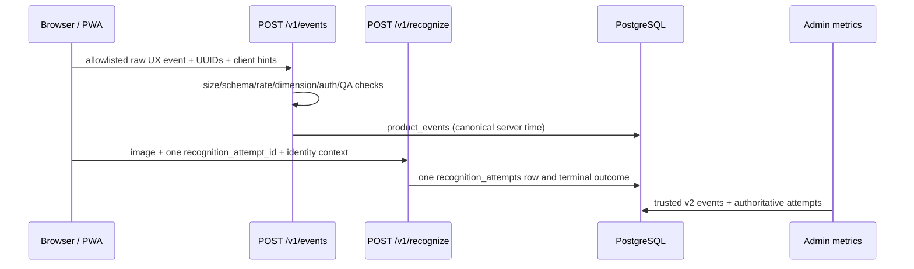

# Analytics Architecture

Status: CURRENT — trusted analytics schema v2 begins 2026-08-23. Earlier rows are retained as `LEGACY_UNVERIFIED` and are not silently treated as business facts.

## Data flow and trust boundary

`web/lib/analytics.ts` creates a random UUID `anonymous_id` in localStorage and a random UUID `session_id` in sessionStorage. The former is a pseudonymous browser identity across sessions; the latter represents one browser-tab session. Neither is authentication or authorization. `useAuth.ts` provides the current Supabase access token to the analytics transport; `get_optional_current_user` validates it server-side and derives `user_id`. A browser-supplied `user_id` is rejected.

On authenticated traffic, `analytics_identity_links` relates an anonymous browser UUID to the verified user without rewriting history. One user can have multiple anonymous identities; an anonymous identity cannot silently be reassigned to another user. `analytics_sessions` fixes each session UUID to its anonymous/authenticated identity context and rejects identity swapping.

## Trust model

| Class | Fields/facts | Rule |
|---|---|---|
| `SERVER_TRUSTED` | `occurred_at`, `server_received_at`, verified `user_id`, `internal_test`, trust/business eligibility, recognition terminal outcome/status/artwork/institution | Generated or verified by FastAPI; business metrics may use them. |
| `CLIENT_ASSERTED` | allowlisted event name, UUID `event_id`, `anonymous_id`, `session_id`, recognition-attempt correlation, UI dimensions | Strictly validated and useful as raw UX observations; never authorization. |
| `CLIENT_HINT` | `client_occurred_at`, referrer, source/UTM, locale/language, device/browser/OS, path, bounded properties | Diagnostic/acquisition context only; cannot control QA exclusion, account identity or authoritative recognition. |

The server writes `CLIENT_VALIDATED_V2` for accepted public v2 events and `SERVER_OPERATIONAL` for backend operational events. Event ID is the idempotency key. A duplicate delivery returns the existing ID without another row. Canonical time is server UTC; client time is stored separately only within ±24 hours.

## Authoritative recognition facts

Every scan uses one UUID `recognition_attempt_id` from `app-state.ts` through `api.ts`, `/v1/recognize`, the `recognition_attempts` row, response and companion UX events. The row is also recognition-request idempotency: a completed retry returns its stored response. Exactly one terminal outcome is stored: `success`, `uncataloged_result`, `no_match`, `invalid_image`, `timeout`, `failed`, or `institution_not_ready`. Founder recognition KPIs count attempt rows, not companion events.

## QA, validation and abuse controls

Controlled QA sends `X-ELYIO-QA-Token`, matched in constant time against server secret `ANALYTICS_QA_TOKEN`. The token is never bundled into browser code; controlled tooling places it in sessionStorage. Public `properties.internal_test` is stripped and cannot mark traffic internal. Trusted QA remains queryable as raw data but is excluded from business metrics.

`/v1/events` accepts only the v2 allowlist, UUID identifiers, active institutions and valid artwork/institution relationships for artwork events. Limits are 32 KiB body, 8 KiB properties JSON, nesting depth 5, arrays 50, bounded fields, and 120 requests/minute per hashed source IP and per anonymous UUID per Fly process. IP hashes are transient rate-limit keys, not persisted product-event dimensions. This lightweight limiter reduces amplification but is not a distributed edge quota.

## Raw events versus business facts

`product_events` preserves validated UI observations. `recognition_attempts` is the authoritative recognition ledger. Admin visitor/activity queries require schema v2, `business_eligible=true`, trusted `internal_test=false`, identity, and a meaningful allowlisted action; recognition metrics use linked attempt rows. Health checks, identityless backend smoke, QA and legacy rows cannot activate a visitor.

PostHog remains a separate client destination. The first-party PostgreSQL/admin definitions in `METRIC_DEFINITIONS.md` are canonical for founder metrics.
