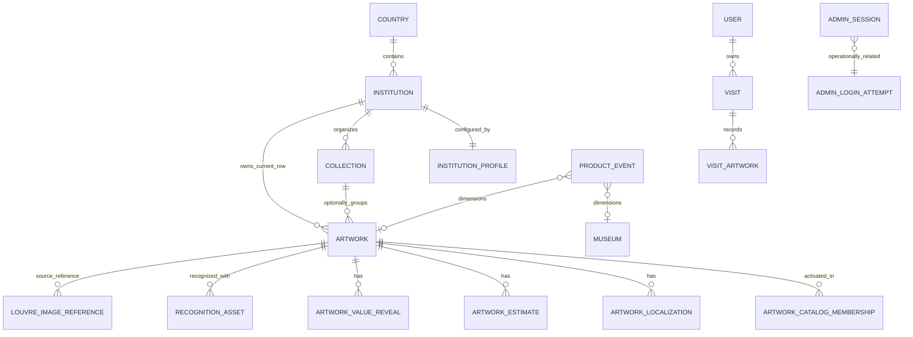
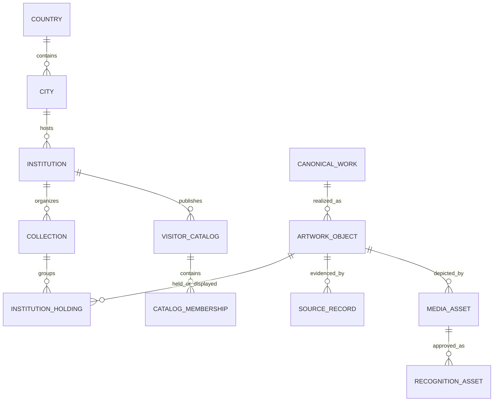

# Data Model: Current and Target

Status: CURRENT schema plus separately marked PROPOSED target.

## Current model

### Current support by concept

| Concept | Current representation | Limitation |
|---|---|---|
| Country | `countries` keyed by ISO alpha-2 code | No normalized City entity yet. |
| City | `museums.city` string; events optional `city` | No City entity/code/timezone/locales. |
| Museum/institution | Existing `museums` table is the canonical Institution store; stable IDs/FKs preserved. It now has country, city, timezone, default/supported locales and active state. | Python name/API remains `Museum` for compatibility; no institution type or normalized City yet. |
| Collection/department | Optional hierarchical `collections`; nullable `artworks.collection_id`; legacy strings remain. | Existing artworks are intentionally not forced into artificial collections. |
| Artwork | `artworks.id` plus source identity | One row belongs to one museum; cannot model the same work across owning/display institutions cleanly. |
| Artist | `artist` string, optional creator QID/raw JSON | No canonical Artist entity/alias graph. |
| Catalog membership | versioned `artwork_catalog_memberships` plus one `institution_profiles` row per institution | Visitor catalog version, candidate universe, policy, thresholds and asset-substitution policy are data-backed. |
| Artwork location | `hall`, `room`, `current_location_raw`, display status | Point-in-time strings; no effective dates/history. |
| Temporary exhibition/loan | Not modeled | Requires overwriting location/museum or custom metadata. |
| Editions/copies | No explicit work/object/edition distinction | Source IDs can distinguish objects, but semantic relationships are absent. |

### Identity

`Artwork.id` is ELYIO's operational primary key. `(source, source_record_id)` is unique when populated. `inventory_number` is not globally unique. `museum_id` is a required FK, so current identity conflates catalog object with one institution association. Catalog membership has its own row but repeats museum ID without a cross-field DB constraint tying membership museum to artwork museum.

## Institution profile contract

`candidate_universe` is one of `ACTIVE_CATALOG`, `INSTITUTION_ARTWORKS`, `NONE`; recognition policy is `TOP_N_METADATA`, `ASSET_VERIFY`, `UNCATALOGED_ONLY` or `NOT_READY`. Missing/inactive/invalid profiles fail closed with `institution_not_ready`. `ACTIVE_CATALOG` also fails closed when its configured version has no active memberships. There is no all-museum fallback.

## Pre-migration production counts

Read-only snapshot 2026-08-23: 1,222 museums; 944 artwork rows; 790 active membership rows; 180 recognition assets; 2,745 Louvre image-reference rows. Counts are not architectural constants.

## Proposed global model

This target is PROPOSED. It separates canonical work concepts, physical objects/editions, institution holdings, time-bounded location/loan state, source records and licensed media. See `GLOBAL_TARGET_ARCHITECTURE.md`.
