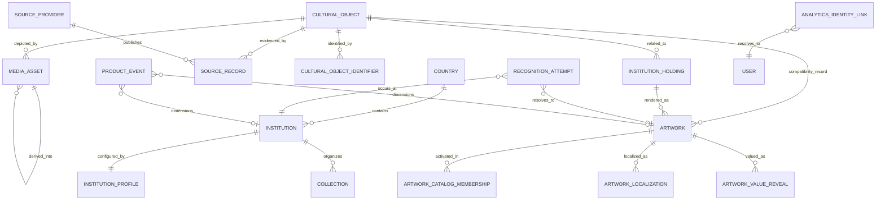

# Data Model

Status: CURRENT schema after migration `0004_global_media_identity_foundation`; explicitly proposed items are marked.

## Current model

## Entity contract

| Entity | Current purpose | Important constraint/limitation |
|---|---|---|
| `countries` | ISO alpha-2 identity, defaults for locale/timezone/currency and policy hooks | City is still a string, not an entity. |
| `museums` / `Institution` alias | Stable institution ID/slug/name, country, city, timezone, locales, display currency, active state | Historic table/API name is retained. |
| `institution_profiles` | Data-backed visitor catalog, candidate universe, recognition policy/thresholds/modes and directory priority | One active profile per institution. |
| `collections` | Optional hierarchical institution collection/department | Existing artworks are not artificially assigned. |
| `cultural_objects` | Stable ELYIO cultural/physical object identity | Pragmatic object identity, not full Work/Edition ontology. |
| `institution_holdings` | Institution record/relationship, collection, status, location and effective dates | Exhibition workflows are not implemented. |
| `source_providers` / `source_records` | Namespaced provider truth and immutable raw/source context | Upstream licensing still requires review. |
| `cultural_object_identifiers` | Globally namespaced external ID | Namespace+identifier unique. |
| `cultural_object_duplicate_reviews` | Explicit same/possible/distinct decision | No automatic merge tool. |
| `media_assets` | Generic purpose, provenance, rights, eligibility and derivative lineage | Legacy readers still use old columns. |
| `artworks` | Backward-compatible visitor/editorial/catalog record | Existing IDs preserved; points to one object and holding after migration. |
| `artwork_localizations` | Visitor-facing content by arbitrary locale and mode | Shipped UI bundles remain en/fr/zh-Hans. |
| `artwork_catalog_memberships` | Versioned activation for visitor recognition/catalog | Does not itself assert ownership. |

## Conservative backfill

Migration 0004 creates one `LEGACY_SINGLETON` object and one current holding per existing Artwork using deterministic IDs. It performs no title/artist/image merge and preserves every current public artwork ID and analytics dimension. `(provider_id, provider_record_id)` and `(institution_id, institution_record_id)` prevent exact repeated imports. Source-language metadata is separate from localized editorial content.

## Institution international configuration

`backend/app/international.py` validates arbitrary BCP-47 tags, IANA timezones and three-letter currency codes, then resolves Institution overrides over Country defaults. Analytics timestamps/cohorts remain trusted UTC; institution timezone is for local display/business context. Currency is a display/policy selection only—no FX conversion exists. `content_policy` is a configuration boundary, not a legal rules engine.

## Recognition semantics

`recognition_attempts.terminal_outcome` remains the canonical KPI outcome (`success`, `failed`, `no_match`, `invalid_image`, `timeout`, `uncataloged_result`). `engine_outcome` states what the engine established; `visitor_resolution` states the UX resolution (`AUTO_ACCEPTED`, `CONFIRMATION_REQUIRED`, `GENERATED_RESULT`, `NO_RESULT`). Thus a candidate found with `needs_confirmation` can be engine success while still not visitor-confirmed. Metrics must name which concept they count.

## Analytics trust

`product_events` is raw validated schema-v2 UX telemetry; event ID, server times, authenticated identity, QA classification, trust and business eligibility are server-owned. `recognition_attempts` is the authoritative attempt ledger. Identity links preserve anonymous history without rewriting it. Legacy events remain unverified and are not promoted into founder facts.

## Dated migration snapshot

On 2026-08-23 transaction validation against the current production schema found 944 Artwork rows and produced 944 objects, 944 holdings and 3,290 generic media rows before rollback. Production counts are observations, not constants.

## Still proposed

A normalized City, canonical Artist, richer Work/Edition hierarchy, exhibition management and institution-operator roles remain PROPOSED. Add them only when real second-country data requires them.
