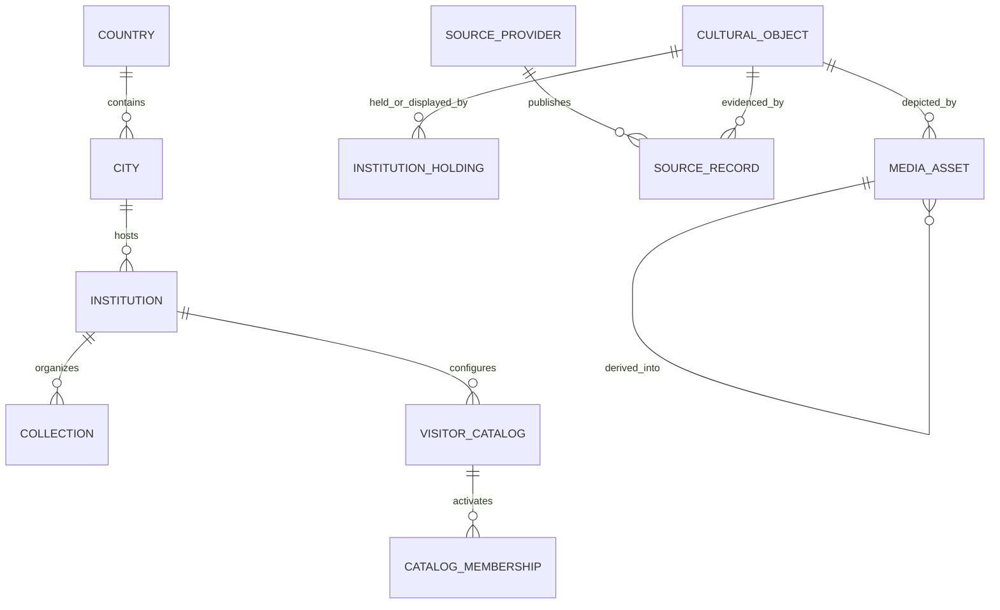

# Global Target Architecture

Status: **PROPOSED**, except items explicitly labeled IMPLEMENTED.

## Direction

Keep the Next.js/FastAPI/PostgreSQL modular monolith. Global expansion should add institution/source data and reviewed configuration, not museum-specific application branches or premature services.

## Implemented foundation

- Country; compatible Institution in `museums`; optional Collection; DB-backed Institution Profile and fail-closed catalog/recognition resolution.
- CulturalObject, InstitutionHolding, SourceProvider/SourceRecord, namespaced identifiers, duplicate-review state and generic MediaAsset.
- Country/Institution locale, IANA timezone, display currency and content-policy boundary.
- Trusted analytics identity and recognition attempt model; engine outcome separated from visitor resolution.
- Migration ledger and release identity.

## Proposed evolution

1. Add normalized City only when shared city metadata/routing makes a string insufficient.
2. Move provider adapters onto the generic adapter contract and add reusable ingest/upsert tooling.
3. Review/backfill media provenance and switch runtime reads from legacy image tables to `media_assets` behind parity tests.
4. Add localized Institution/Collection/Object metadata rows and a locale registry/content fallback service; ship new UI bundles deliberately.
5. Introduce a distinct conceptual Work/Edition layer only when real records require grouping multiple physical objects.
6. Add time-bounded exhibition/loan workflows only after institution data supplies authoritative changes.
7. Add daily aggregates/stronger distributed rate control when measured traffic warrants it.

## National Gallery architecture paper test

The core can represent Country GB, a London institution, `Europe/London`, `en-GB`, GBP, objects/holdings/provider records/media and a fail-closed profile without institution-specific core changes. Remaining work is a National Gallery source adapter/content package, rights assessment, ingest, catalog membership/profile activation, benchmarks and production validation. Current frontend has no complete `en-GB` bundle distinction and SEO routes are a France content package; these are onboarding/content work, not schema or recognition-core blockers.

## Non-goals

No per-institution service/database, Kafka, warehouse, graph database, live FX conversion, global legal engine, automatic uncertain dedupe, or exhibition-management suite at current scale.
