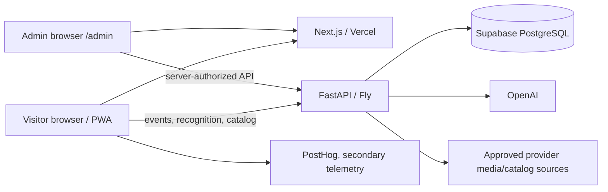

# System Overview

Status: CURRENT after Globalization Blocks 1–3.

## Runtime topology

The localized public website is static/server-rendered. `/visit` is the anonymous-first client application. `/admin` is noindex; authorization and data are server-side. Production release identity is exposed by `/health` and admin System.

## Visitor and analytics flow

1. Browser owns a validated persistent anonymous UUID and sessionStorage-scoped session UUID.
2. Public schema-v2 events use an allowlist/idempotent event ID. Server owns canonical time, authenticated user, QA status, trust and business eligibility.
3. Each scan creates one `recognition_attempt_id`, sent with frontend events and `/v1/recognize`.
4. Backend owns the authoritative RecognitionAttempt terminal outcome; companion UX events remain raw evidence, not extra KPI attempts.
5. A verified login links anonymous history to user identity without rewriting old events.
6. Admin metrics exclude trusted QA/legacy/unqualified events and distinguish raw event from business fact.

## Catalog and identity flow

Institution resolution is Country + compatible `museums` Institution + optional Collection + Institution Profile. Profiles select a versioned catalog/candidate policy and fail closed when invalid. Artwork runtime IDs remain stable, while CulturalObject, InstitutionHolding and SourceRecord distinguish identity/relationship/evidence. Generic MediaAsset explicitly records presentation/reference/recognition/source/derivative roles and rights/provenance.

## International boundary

Country/Institution configuration supports ISO country code, arbitrary BCP-47 locale tags, IANA timezone, three-letter display currency and policy hooks. UI currently ships complete `en`, `fr`, `zh-Hans` bundles only. UTC remains analytics truth. No FX conversion is implied by display currency. Current France SEO/content is preserved as a content package, not treated as a global default.

## Major invariants

| Boundary | Rule |
|---|---|
| Public/private | SEO content public; visit state, captures and admin private/noindex. |
| Institution | Data/configuration; no all-museum recognition fallback. |
| Identity | Object != holding != provider record != compatibility Artwork. |
| Media | Presentation != reference != recognition asset != private capture. |
| Rights | UNKNOWN is explicit and never auto-promoted. |
| Localization | Source metadata preserved; localized visitor copy separate. |
| Value | Value V4 remains EUR-grounded; responsible numeric ranges always receive deterministic scale context, while no-estimate states receive no fabricated equivalents. Local wording derives from Institution city and currency selection is not conversion. |
| Recognition metrics | Engine terminal outcome and visitor resolution are separately named. |
| Deployment | Ordered migration ledger; reviewed main/release source reports SHA. |

## Production API surface

Key public paths are `/health`, `POST /v1/events`, `POST /v1/recognize`, `POST /v1/indicative-value`, `GET /v1/museums`, `GET /v1/artworks/{artwork_id}`, `GET /v1/image-proxy`, and authenticated visit endpoints. `/v1/admin/*` covers login/session, dashboard, recognition, users, artworks, museums, catalog, acquisition, system and export. OpenAPI/current code is authoritative.

## Compatibility state

Legacy artwork/image/source columns and Louvre source tables remain live so Block 3 does not change recognition or visitor presentation behavior. New normalized tables are the write target for future adapters; runtime migration occurs only behind parity tests. No National Gallery data exists.
