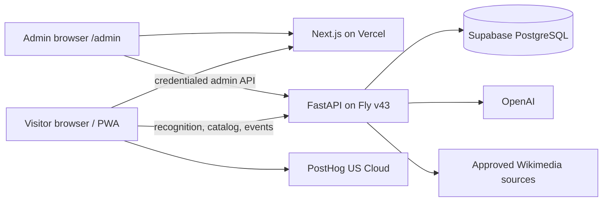

# System Overview

Status: CURRENT at production source `5c5ac7e`.

## Runtime topology

The public localized website is static/server-rendered. `/visit` is the anonymous-first client app. `/admin` is a noindex client Control Center whose data and authorization live exclusively in FastAPI; the frontend does not possess an admin secret.

## Product data plane

1. Browser creates persistent `anonymous_id` in localStorage and a tab-lifetime `session_id` in sessionStorage.
2. Explicit events are sent both to first-party `POST /v1/events` and, when configured, PostHog.
3. Recognition creates a separate `recognition_attempt_id` per capture and attaches it to browser-side attempt/result events.
4. Backend recognition creates identityless operational events because `/v1/recognize` does not receive browser identity/attempt ID.
5. Admin metrics exclude events with `properties.internal_test=true` and exclude identityless server events from visitor recognition KPIs.

## Major boundaries

| Boundary | Rule |
|---|---|
| Public vs private | SEO HTML is public/indexable; visit/admin/session routes are noindex. |
| Visitor vs admin auth | Supabase JWT protects server visits; separate hashed-cookie sessions protect admin. |
| Knowledge vs visitor catalog | `artworks` holds facts; `artwork_catalog_memberships` activates versioned subsets. |
| Presentation vs recognition | `Artwork.image_url`, `RecognitionAsset`, and source/reference records are distinct concepts. |
| Client vs server analytics | Client events have visitor identity; server recognition events are operational and identityless today. |
| Current vs target | Current France-specific schema is documented in `DATA_MODEL.md`; proposed global entities are not claimed as implemented. |

## Current production API inventory

Verified from live OpenAPI on 2026-08-23:

| Method | Path | Access/purpose |
|---|---|---|
| POST | `/v1/admin/login` | Public credential exchange; throttled |
| POST | `/v1/admin/logout` | Revokes caller cookie session when present |
| GET | `/v1/admin/me` | Admin cookie required |
| POST | `/v1/events` | Public first-party event ingestion |
| GET | `/v1/admin/dashboard` | Admin aggregate dashboard |
| GET | `/v1/admin/recognition/failures` | Admin failure rows |
| GET | `/v1/admin/users` | Admin users/anonymous visitors |
| GET | `/v1/admin/users/{identity}` | Admin event timeline |
| GET | `/v1/admin/artworks` | Admin artwork health/search |
| GET | `/v1/admin/museums` | Admin museum metrics |
| GET | `/v1/admin/catalog` | Admin catalog health |
| GET | `/v1/admin/acquisition` | Admin source metrics |
| GET | `/v1/admin/system` | Admin service/tracking facts |
| GET | `/v1/admin/export/{kind}` | Admin CSV export |
| POST | `/v1/indicative-value` | Public bounded value context |
| POST | `/v1/recognize` | Public museum-scoped recognition |
| GET | `/v1/museums` | Public directory |
| GET | `/v1/artworks/{artwork_id}` | Public catalog detail |
| GET | `/v1/image-proxy` | Public allowlisted image transform/cache |
| POST | `/v1/visits` | Supabase JWT required |
| POST | `/v1/visits/{visit_id}/artworks` | Supabase JWT required |
| GET | `/v1/visits/{visit_id}/progress` | Supabase JWT required |
| POST | `/v1/visits/{visit_id}/complete` | Supabase JWT required |
| GET | `/health` | Public health |

## Production discrepancy

`origin/main` is not production source. Current production was built immediately after `5c5ac7e` on the documentation branch. Restoring a reviewed deployable mainline is the first operational correction.
