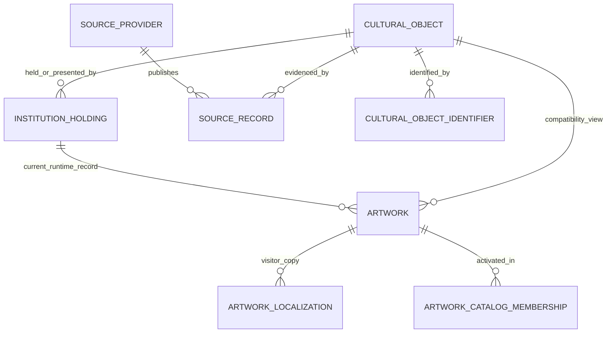

# Artwork Identity

Media identity is orthogonal to artwork identity. `MediaAssetAssociation` explicitly targets either the conceptual CulturalObject or an institution-specific Holding; source media does not redefine or merge the object. Multiple objects may reference one media entity without collapsing their canonical identities.

## Generic reconciliation (CURRENT)

Identity first uses unique provider/record, then institution/accession, then explicit reviewed mapping. Title/creator/date are weak evidence only and yield `POSSIBLE_DUPLICATE`, never automatic merge. Existing Artwork IDs remain compatible.

Status: CURRENT after migration `0004_global_media_identity_foundation`.

## What an `Artwork` row meant before Block 3

One `artworks` row mixed four concerns: ELYIO visitor/public artwork, one institution holding, one imported provider record, and sometimes the implied cultural object. `Artwork.id` was stable, and `(source, source_record_id)` was unique when populated, but the required `museum_id` made `artwork == holding == source record` the practical model. Title/artist fuzzy matching was recognition candidate discovery, never safe identity.

## Current incremental model

- `cultural_objects`: stable ELYIO object identity. It does not claim a full art-historical work/edition ontology.
- `institution_holdings`: institution relationship and institution-local record ID, optional collection, relationship/status/location and effective dates. This is sufficient foundation for a loan or temporary display without changing object identity.
- `source_providers` + `source_records`: provider namespace and record identity, URL, source language, retrieval time and raw evidence.
- `cultural_object_identifiers`: unique external identifiers by namespace.
- `cultural_object_duplicate_reviews`: explicit `CONFIRMED_SAME`, `POSSIBLE_DUPLICATE`, or `DISTINCT` decisions; uncertain candidates are never auto-merged.
- `artworks`: compatibility/runtime/editorial record. Existing IDs, URLs, analytics dimensions and recognition catalog membership are preserved; each row now points to an object and holding.

## Migration semantics

Every legacy artwork receives deterministic IDs `object:<artwork_id>` and `holding:<artwork_id>`, with `identity_status=LEGACY_SINGLETON`. This deliberately does not merge records. Provider records are keyed by `(provider_id, provider_record_id)`. Current source identity collisions were preflighted before migration. Legacy columns remain during the compatibility phase.

The PostgreSQL `trg_artworks_global_identity` compatibility trigger assigns the same deterministic object/holding identities when an older importer inserts an Artwork without normalized foreign keys. It prevents current operational importers from bypassing NOT NULL identity while they are migrated to the adapter contract; it does not create provider/media provenance or merge records.

## Identity and collision rules

1. ELYIO IDs are immutable; an importer may not derive global identity from title, artist, translated title, museum slug or image similarity.
2. Exact repeat of `(provider_id, provider_record_id)` is the same source record and is rejected by a unique constraint.
3. `(institution_id, institution_record_id)` identifies one institution holding record and is unique when provided.
4. A localized title is content on the same artwork/object, not a new object.
5. Two objects with the same title/artist remain distinct unless evidence is reviewed.
6. Editions, casts and copies default to distinct objects. A review row can relate suspected duplicates without destructive merging.
7. A confirmed merge, when tooling is later added, must re-point references transactionally, retain every source record/identifier and record the decision. Migration 0004 performs no merges.

## Remaining limitation

`Artwork` still carries institution/source compatibility columns and recognition returns an `Artwork.id`. This is intentional to preserve production behavior. Core ingest should create object/holding/source records first, then the compatibility artwork and catalog membership. Removal of legacy columns is a later migration only after all readers use the normalized model.
