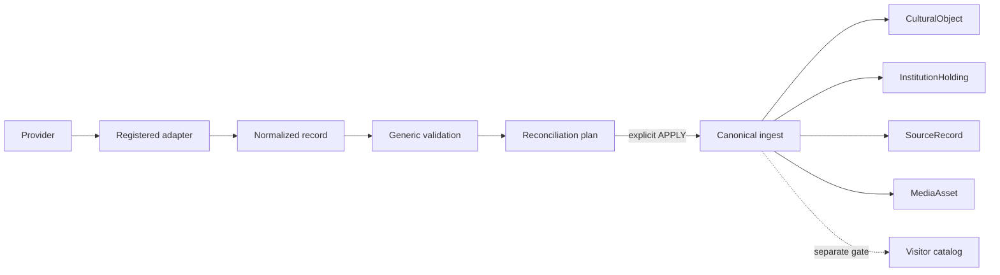

# Generic Ingestion Architecture

Status: CURRENT (Block 4, 2026-08-23). Importing data does not activate it.

The contract is `backend/app/source_adapter.py`; provider-neutral logic is `backend/app/ingestion.py`; implementations live under `backend/app/adapters/`. Core code has no institution/provider conditional. `normalized_json_v1` is the deterministic snapshot reference adapter and has no network access.

The standard runner is `python -m backend.scripts.ingest_catalog MODE --adapter normalized_json_v1 --provider PROVIDER --institution INSTITUTION --input SNAPSHOT.json`. Modes: DISCOVER, DRY_RUN, PLAN, APPLY, RECONCILE, STATUS. No mode defaults to APPLY; APPLY requires `--operator`.

- DISCOVER validates target/config and source shape with no writes.
- DRY_RUN and PLAN reconcile with no writes.
- APPLY refuses invalid, conflicting or disappeared-source plans, records an `IngestionRun`, and commits atomically.
- RECONCILE reports missing provider records as HIGH_RISK and never deactivates them.
- STATUS reports source/run synchronization and existing recognition readiness.

Identity priority is provider + record ID, institution + accession ID, then an explicitly reviewed mapping. Title/creator is only a possible-duplicate suggestion. Repeated APPLY does not duplicate objects, holdings, source records, media or memberships. `IngestionChange` records every applied/review-required item. Generic ingestion never creates catalog membership.

Media discovery never downloads media. UNKNOWN/DECLARED_BY_SOURCE never self-promote to VERIFIED or eligibility. Provider disappearance, identity changes and cross-institution conflicts are not silently applied. Failed APPLY rolls back and records FAILED state.

Legacy classification: direct-upsert `import_demo_catalog_to_db.py`, `import_versailles_launch_catalog.py`, and `import_paris_curated_*` are museum-specific legacy; Louvre production/Phase2 scripts are source-specific legacy or research; `louvre_acquire_approved_assets.py` is a legitimate Louvre-side acquisition tool; `import_museofile_museums.py` is directory-only; Louvre recognition scripts are benchmarks. They are retained for evidence but are not the onboarding path for new institutions.

National Gallery paper test: custom work is endpoint/snapshot discovery, provider field mapping, pagination/retry, rights declaration mapping and conservative collection mapping. Canonical identity, holding/source/media models, runner, recognition and analytics core need no change.
