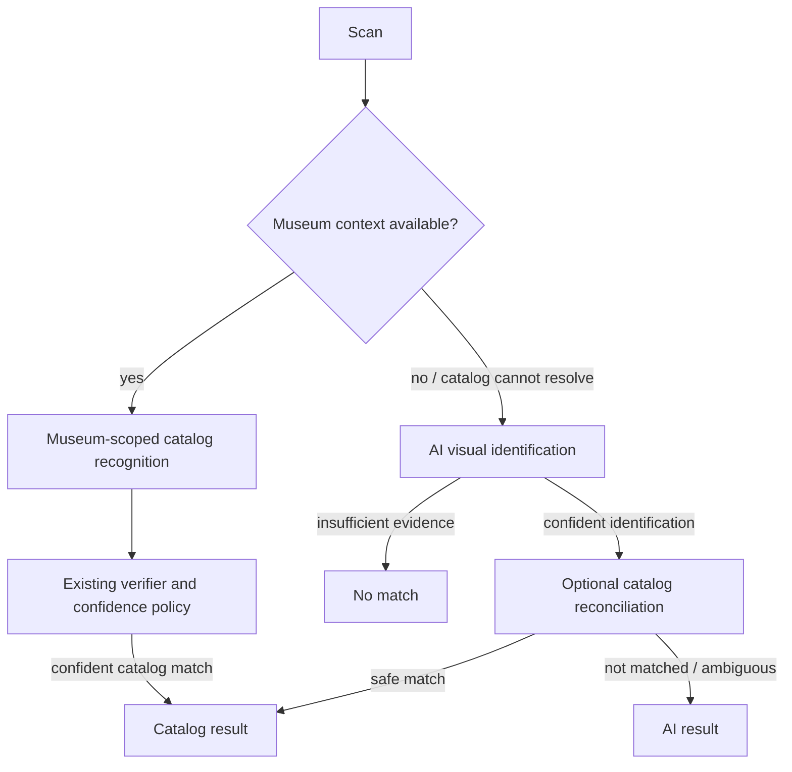

# Recognition Pipeline

Media readiness is association-aware: a recognition reference requires an explicitly selected `RecognitionAsset` associated with the correct object/holding. Shared contextual media is never promoted into every linked object's candidate evidence. A selected HTTPS RecognitionAsset may be fetched into the bounded local reference cache at verification time; provider hosts are data, not hardcoded recognition branches.

Recognition is a cascade. A known museum uses its museum-scoped catalog and existing verifier. When museum context is absent, or catalog reconciliation cannot safely resolve an AI identification, AI visual identification remains a first-class result path. Catalog reconciliation is enrichment, not a success gate. Media/provenance gates constrain curated assets, not the AI-only result path.

Status: CURRENT; Block 3 does not replace ranking or decision algorithms.

## Request/context

`POST /v1/recognize` accepts a validated base64 image, optional `museum_id`, locale, optional hint/benchmark mode, and UUIDs for recognition attempt, anonymous identity and session. The attempt UUID propagates through request, backend ledger, response and companion events. A known Institution Profile supplies the museum-scoped candidate universe, catalog version, prompt context, thresholds, candidate limit and asset-substitution policy. Missing museum context is valid and uses the AI-first path; it is not a blocking prerequisite.

Production latency profiling is opt-in via `benchmark_mode="latency_profile"`. It reports stage durations tied to the same recognition attempt UUID without storing or logging user images. This mode exists for operations measurement only; it does not change the recognition decision path.

## Candidate/decision path

Stage 1 extracts observable evidence/OCR and possible identity without inventing catalog IDs. With a museum, `backend/app/catalog.py` fetches only that institution's eligible candidates and the existing verifier/threshold policy decides the catalog result. Without a museum, AI identification is evaluated first; global reconciliation is optional enrichment. A confident AI identity may return an AI result without an `artwork_id`. Only insufficient identification becomes semantic `no_match`. Provider/country/currency/locale do not choose algorithm branches.

The process reuses one OpenAI client per warm backend process for recognition calls so Stage 1 and verifier calls can reuse provider transport state. This is a transport optimization only; prompts, models, retries, thresholds and candidate safety gates remain unchanged.

## Media meaning

`VISION_PLUS_ASSET` means an eligible prepared reference/recognition asset participates or is available according to the current policy. `VISION_READY` is the vision+metadata path without such reference comparison. `NOT_READY` is operational readiness, not a successful response mode. Migration 0004 mirrors legacy assets into generic `media_assets`, but recognition still reads existing `RecognitionAsset`/image compatibility fields to guarantee parity.

For catalogs with versioned visual descriptors, the bounded funnel is: institution-scoped active membership → full cheap metadata ranking plus cheap low-frequency visual-descriptor ranking → at most five fused candidates → at most three real reference images in one verifier call. The descriptor is retrieval evidence only and can never attach canonical identity. The final verifier must compare the visitor image with the real references and may return `NO_MATCH`. Descriptor payloads live on `RecognitionAsset`, are versioned (`elyio-lowfreq-rgb-v1`), and are invalidated by the active catalog/profile version. This keeps expensive model work bounded as the institution catalog grows.

The National Gallery controlled runtime is now `ng-controlled-2000-v1-retrieval`: 2,000 scoped candidates still produce at most five fused candidates, three reference images and one bounded reference-verifier call. A verifier `NEEDS_CONFIRMATION` decision is capped below the unchanged auto threshold. When metadata/visual evidence conflicts inside a same-artist family, or confident Stage-1 artist attribution conflicts with the reference candidate, the generic safety rule preserves confirmation instead of auto-acceptance. Thresholds remain `.92/.82`. See [the dated 2,000-work benchmark](NATIONAL_GALLERY_CONTROLLED_2000_BENCHMARK_2026-08-25.md).

Presentation image != source/reference != RecognitionAsset. The generic model adds explicit purposes and eligibility; runtime may not infer recognition permission from presentation availability or public-domain artwork status.

`RecognitionAsset` is not required for `VISION_READY`. That path sends the visitor image, institution context and the top five institution-scoped candidate metadata summaries to the two vision passes; no presentation/source/reference bytes are sent. `VISION_PLUS_ASSET` compares the visitor image against a bounded set of up to three selected references in one model call when versioned descriptors are available; legacy catalogs retain the single-candidate/runner-up path. National Gallery testing on 2026-08-24 showed that this distinction is operationally material for visually confusable works; see `NATIONAL_GALLERY_BENCHMARK_2026-08-24.md` and `NATIONAL_GALLERY_500_QUALITY_RECOVERY_2026-08-24.md`.

## Engine outcome versus visitor resolution

`RecognitionAttempt.terminal_outcome` is the one KPI terminal fact. New columns make semantics explicit:

| API status/path | Engine outcome | Visitor resolution | KPI interpretation |
|---|---|---|---|
| `matched` | `CATALOG_CANDIDATE_MATCHED` | `AUTO_ACCEPTED` | successful usable result |
| `needs_confirmation` | `CATALOG_CANDIDATE_MATCHED` | `CONFIRMATION_REQUIRED` | engine success/candidate found, not user-confirmed |
| `matched`, `result_source=catalog` | `CATALOG_CANDIDATE_MATCHED` | `AUTO_ACCEPTED` | successful grounded catalog result; `artwork_id` is non-null |
| `matched`, `result_source=ai` | `AI_IDENTIFIED_CATALOG_NOT_MATCHED` | `GENERATED_RESULT` | successful AI result; `artwork_id` is null and catalog reconciliation is `not_matched`/`ambiguous` |
| legacy `no_match` with an understood identity | `UNCATALOGED_IDENTIFIED` | `GENERATED_RESULT` | compatibility path for older configured-institution fallback |
| `no_match` | `NO_MATCH` | `NO_RESULT` | failed/no-match attempt |
| invalid input | `INVALID_INPUT` | `NO_RESULT` | invalid attempt |
| provider/runtime exception | `ENGINE_ERROR` | `NO_RESULT` | technical error; client receives retryable error with correlation ID |

Admin “engine success” includes a candidate requiring confirmation, matching the canonical terminal attempt definition. It separately reports `confirmation_required`; product reporting must not label this as a confirmed catalog recognition. Future explicit visitor confirmation would be a separate state/event, not a reinterpretation.

### Response contract and terminal states

The production response uses these source semantics:

- Catalog success: `status=matched`, `result_source=catalog`, `artwork_id` non-null, `catalog_match_status=matched`.
- AI-only success: `status=matched`, `result_source=ai`, `artwork_id=null`, `catalog_match_status=not_matched` or `ambiguous`, with the structured AI identification used by the visitor card.
- Semantic no-match: `status=no_match`; identification evidence was insufficient. A catalog miss alone is not this state.
- Provider/runtime failure: retryable HTTP error with `error_code` and `recognition_request_id`; it is not converted into semantic no-match.

The ordered migration `0009_ai_recognition_outcome.sql` extends the production
`recognition_attempts.terminal_outcome` check constraint with `ai_result`.
Allowed terminal outcomes are `success`, `ai_result`, `no_match`,
`uncataloged_result`, `invalid_image`, `timeout`, `failed`, and
`institution_not_ready` (or NULL while an attempt is in progress). This list
must remain synchronized with `finish()` and the admin success/failure sets.

## Behavior and scale

Matched/usable results can create one automatic sighting; repeat dedupe remains visit-state logic. No-match/network failure does not count. AI-only results preserve private visitor-card enrichment and do not become public catalog/SEO content. `result_source` is `catalog` or `ai`; `catalog_match_status` is `matched`, `not_matched`, `ambiguous`, or `not_attempted` where present. Learned visual retrieval remains disabled and is a non-blocking future improvement.
