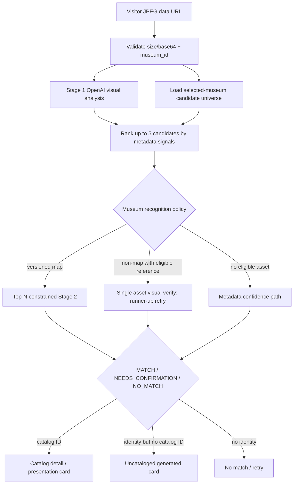

# Recognition Pipeline

Status: CURRENT production path in `backend/app/main.py` and `backend/app/catalog.py`.

## End-to-end flow

## Request and context

`POST /v1/recognize` accepts `image_base64`, required `museum_id`, optional `hall_hint`, `locale`, and a test-only `benchmark_mode`. Maximum base64 characters defaults to 8,000,000. The backend does not receive browser `anonymous_id`, `session_id`, or `recognition_attempt_id`; browser and server telemetry therefore cannot be reliably joined today.

Stage 1 (`recognize_open`) sends the visitor image to `OPENAI_RECOGNITION_MODEL` (default `gpt-4o`) with a museum context. Louvre, Orsay and Orangerie have named prompt text; other museums receive their raw ID in a generic sentence. The model returns structured observable features, OCR, likely artist/title, image quality and confidence; it must not emit catalog IDs.

## Candidate universe and ranking

`get_recognition_candidates(db, museum_id)` always filters `Artwork.museum_id`. If the museum has a default version in `DEFAULT_VISITOR_CATALOG_VERSION_BY_MUSEUM` and active membership rows, it additionally scopes to that version. Otherwise every artwork for that museum is eligible. It materializes the candidate list and supporting values/assets, then Python ranks using normalized title/artist/date/hall/object/description signals. Top five proceed.

This is safe for current hundreds-per-museum catalogs but does not scale to million-item institution catalogs without indexed retrieval/preselection.

## Stage 2 variants

### Versioned top-N verifier

`TOPN_VERIFIER_MUSEUMS` is exactly the keys of a hardcoded ten-museum version map. OpenAI sees the visitor image, Stage 1 analysis and metadata summaries for at most five allowed candidates. It returns `MATCH`, `NEEDS_CONFIRMATION`, or `NO_MATCH`; chosen ID must be in the allowed list. An artist-consistency guard can reject attachment.

### Asset visual verifier

For other museums, a high-enough fuzzy candidate with an approved reference image is compared against the visitor photo by `gpt-4o`. A rejected top candidate can trigger one runner-up verification. Reference fetch is allowed only by explicit URL/asset policy and can use local cache.

### Metadata-only fallback

When no eligible reference is available outside the top-N path, combined model/ranking confidence is capped. This path returns `VISION_READY`, not proof of pixel-level asset comparison.

## Readiness/mode vocabulary

| Term | Actual meaning |
|---|---|
| `VISION_PLUS_ASSET` | Result/readiness has an eligible recognition reference/local asset; on single-candidate path it is visually compared. On top-N path the mode can indicate a local asset exists even though the top-N verifier itself uses candidate metadata plus visitor image, not the reference bytes. |
| `VISION_READY` | Metadata/vision path can make a catalog decision without an eligible local reference comparison. |
| `NOT_READY` | Admin catalog-health category for metadata/readiness states such as `INSUFFICIENT`, `NOT_READY`, `NO_USABLE_ASSET`, `RIGHTS_RESTRICTED`. The API response does not return `NOT_READY` as a recognition mode. |
| `READY` | Older/current database status present on 116 rows; admin separately reports status counts. It is not identical to `VISION_READY`. |
| `NEEDS_ASSET` | Current DB status for 38 rows; catalog membership may still be active. |

Status vocabulary needs normalization because DB values and response modes overlap imperfectly.

## Image-role separation

- Presentation image: `Artwork.image_url`, intended for visitor display.
- Recognition asset: `RecognitionAsset.source_url`, with license, attribution, AI/TDM and embedding eligibility.
- Source/reference image: provider evidence such as `LouvreImageReference`; it may be metadata-only and forbidden to fetch.
- Visitor capture: private input/fallback hero; never a public recognition asset.

`catalog.py` can substitute an eligible `RecognitionAsset` as recognition image for non-Louvre works. Louvre substitution is explicitly blocked pending identity reconciliation.

## Confidence and frontend behavior

Global thresholds are hardcoded: automatic match `0.92`, review `0.82`; fuzzy candidate threshold `0.55`. Backend maps catalog results to `matched`, `needs_confirmation`, or `no_match`. Current frontend displays and counts `needs_confirmation` immediately and emits `candidate_confirmed` without a user confirmation action—an explicit semantic defect.

Pure no-match does not count. A no-match with Stage 1 artist/title becomes a private uncataloged generated card and is counted with a time-derived ID; repeat dedupe is not guaranteed. Network errors keep the image for retry and do not count.

## Latency and analytics

Latency depends on one Stage 1 call plus zero/one Stage 2 call, or two asset verifications after runner-up retry, plus DB/image cache work. No capacity/latency claim is made here. Browser emits correlated attempt/result events; backend emits separate identityless `recognition_started/completed/failed`. The current browser does not attach measured `latency_ms`, so admin latency percentiles are often unavailable.

## Current dated snapshot

2026-08-23 production DB: 180 `VISION_PLUS_ASSET`, 610 `VISION_READY`, 116 `READY`, 38 `NEEDS_ASSET`; 180 recognition assets. These counts can change independently of code.
