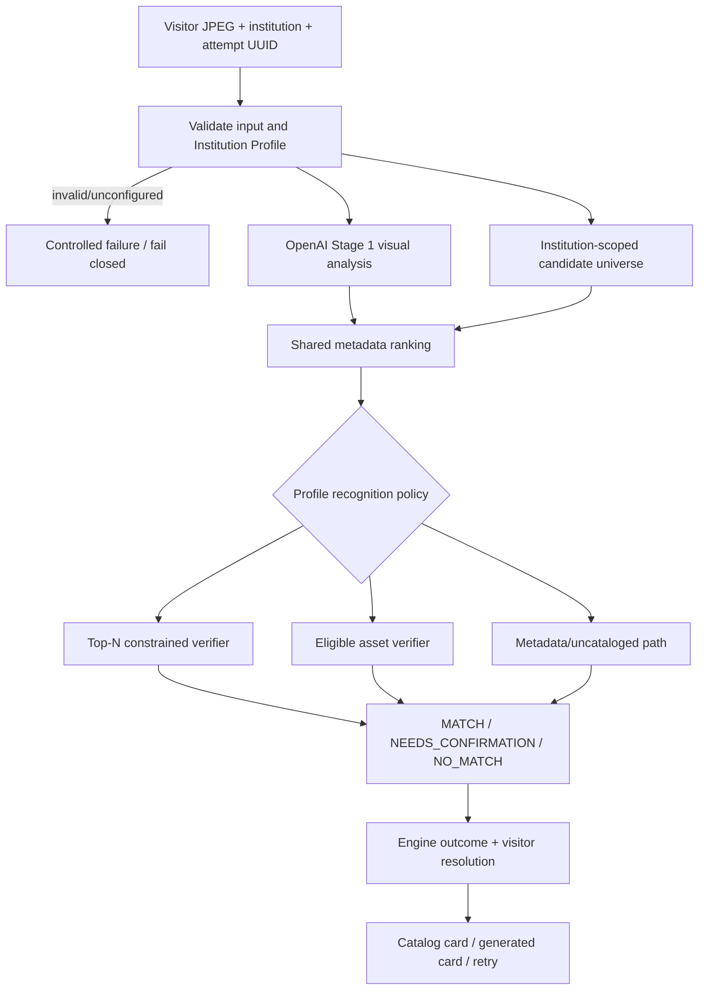

# Recognition Pipeline

Status: CURRENT; Block 3 does not replace ranking or decision algorithms.

## Request/context

`POST /v1/recognize` accepts validated base64 image, required `museum_id` (compatible Institution ID), locale, optional hint/benchmark mode, and UUIDs for recognition attempt, anonymous identity and session. The attempt UUID propagates through request, backend ledger, response and companion events. The Institution Profile supplies candidate universe, catalog version, prompt context, thresholds, candidate limit and asset-substitution policy. Missing/invalid configuration returns controlled `institution_not_ready`; candidates never broaden globally.

## Candidate/decision path

Stage 1 extracts observable evidence/OCR and possible identity without inventing catalog IDs. `backend/app/catalog.py` fetches only `ACTIVE_CATALOG`, `INSTITUTION_ARTWORKS`, or `NONE` for the selected institution. Shared Python scoring ranks title/creator/date/location/object/description signals. Policy then uses constrained top-N metadata verification, an eligible single reference comparison, or uncataloged/no-match behavior. Provider/country/currency/locale do not choose algorithm branches.

## Media meaning

`VISION_PLUS_ASSET` means an eligible prepared reference/recognition asset participates or is available according to the current policy. `VISION_READY` is the vision+metadata path without such reference comparison. `NOT_READY` is operational readiness, not a successful response mode. Migration 0004 mirrors legacy assets into generic `media_assets`, but recognition still reads existing `RecognitionAsset`/image compatibility fields to guarantee parity.

Presentation image != source/reference != RecognitionAsset. The generic model adds explicit purposes and eligibility; runtime may not infer recognition permission from presentation availability or public-domain artwork status.

## Engine outcome versus visitor resolution

`RecognitionAttempt.terminal_outcome` is the one KPI terminal fact. New columns make semantics explicit:

| API status/path | Engine outcome | Visitor resolution | KPI interpretation |
|---|---|---|---|
| `matched` | `CATALOG_CANDIDATE_MATCHED` | `AUTO_ACCEPTED` | successful usable result |
| `needs_confirmation` | `CATALOG_CANDIDATE_MATCHED` | `CONFIRMATION_REQUIRED` | engine success/candidate found, not user-confirmed |
| uncataloged generated result | `UNCATALOGED_IDENTIFIED` | `GENERATED_RESULT` | successful usable uncataloged result |
| `no_match` | `NO_MATCH` | `NO_RESULT` | failed/no-match attempt |
| invalid input | `INVALID_INPUT` | `NO_RESULT` | invalid attempt |
| exception | `ENGINE_ERROR` | `NO_RESULT` | failed attempt |

Admin “engine success” includes a candidate requiring confirmation, matching the canonical terminal attempt definition. It separately reports `confirmation_required`; product reporting must not label this as a confirmed catalog recognition. Future explicit visitor confirmation would be a separate state/event, not a reinterpretation.

## Behavior and scale

Matched/usable results can create one automatic sighting; repeat dedupe remains visit-state logic. No-match/network failure does not count. Uncataloged results preserve private visitor capture fallback and do not become public catalog/SEO content. Current in-process materialization/ranking remains suitable for current catalogs; indexed retrieval/preselection is future scale work, not changed here.
